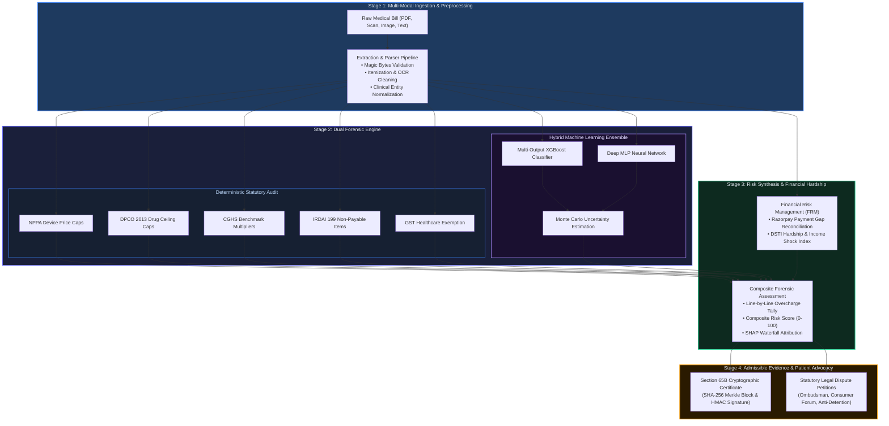
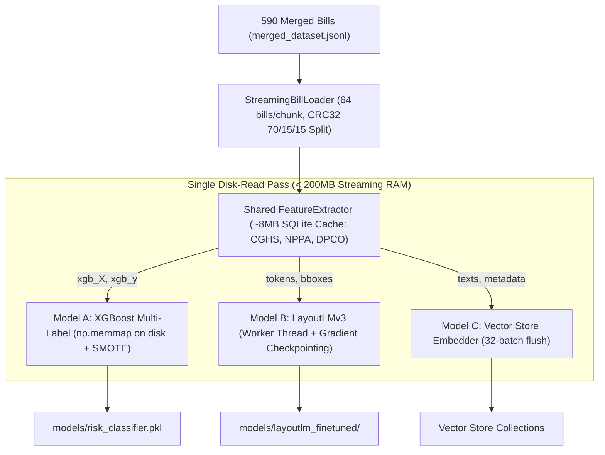

---
{
  "id": "file_4o4mizot",
  "filetype": "document",
  "filename": "README",
  "created_at": "2026-09-04T01:33:06.050Z",
  "updated_at": "2026-09-04T01:33:15.732Z",
  "meta": {
    "location": "/",
    "tags": [],
    "categories": [],
    "description": "",
    "source": "markdown"
  }
}
---
# CuraVeris

## Healthcare Financial Verification & Reconciliation Engine

**Know what you actually owe.**

For repository layout, multi-platform client runtimes, and active foundations, see [Project Structure](#project-structure--directory-tree).

CuraVeris analyzes hospital billing and related insurance/TPA documentation, combines deterministic financial rules with ML-based anomaly intelligence, produces evidence-backed patient responsibility, and connects verified obligations to payment and reconciliation.

```text
DOCUMENTS → INTELLIGENCE → FINANCIAL TRUTH → PAYMENT → RECONCILIATION
```

ML identifies risk; deterministic rules establish facts; the financial engine calculates liability; evidence explains the result; Razorpay moves money; reconciliation verifies the outcome.

---

## Table of Contents

- [Executive Summary & Problem Statement](#executive-summary--problem-statement)
- [Product Model & Operational Pipeline](#product-model--operational-pipeline)
- [Product Surface & Core Capabilities](#product-surface--core-capabilities)
- [Key Features & Subsystems](#key-features--subsystems)
- [Comparative Positioning & Industry Benchmarks](#comparative-positioning--industry-benchmarks)
- [Statutory Framework & Legal Grounding](#statutory-framework--legal-grounding)
- [System Architecture & Data Flow](#system-architecture--data-flow)
- [Multi-Platform Frontend & Client Architecture](#multi-platform-frontend--client-architecture)
- [Backend & API Foundation Architecture](#backend--api-foundation-architecture)
- [Persistence Strategy & Data Model](#persistence-strategy--data-model)
- [4-Way Financial Reconciliation Engine & Exception Routing](#4-way-financial-reconciliation-engine--exception-routing)
- [Quantitative Financial Risk Framework (FRM) Layer](#quantitative-financial-risk-framework-frm-layer)
- [Cryptographic Audit Ledger (Section 65B)](#cryptographic-audit-ledger-section-65b)
- [Machine Learning Ensemble & AI Architecture](#machine-learning-ensemble--ai-architecture)
- [Two-Track Hybrid Production Architecture](#two-track-hybrid-production-architecture)
- [CuraVeris-4B & CuraVeris-1B Custom Transformer Models](#curaveris-4b--curaveris-1b-custom-transformer-models)
- [Modular ML Pipelines for Mobile Apps (Android & iOS)](#modular-ml-pipelines-for-mobile-apps-android--ios)
- [Memory-Efficient Multi-Model Parallel Training](#memory-efficient-multi-model-parallel-training)
- [Complete Technology Stack](#complete-technology-stack)
- [Project Structure & Directory Tree](#project-structure--directory-tree)
- [Platform Security & Compliance](#platform-security--compliance)
- [Enterprise Security Hardening](#enterprise-security-hardening)
- [REST API Reference](#rest-api-reference)
- [Getting Started & Local Development](#getting-started--local-development)
- [Environment Configuration & Secrets](#environment-configuration--secrets)
- [Available CLI Commands](#available-cli-commands)
- [Testing, Playwright E2E & CI Security Gate](#testing-playwright-e2e--ci-security-gate)
- [Documentation Index](#documentation-index)
- [Disclaimer](#disclaimer)
- [License](#license)

---

## Executive Summary & Problem Statement

Indian private healthcare relies on a fragmented three-party financial settlement process that systematically disadvantages patients:

1. **Opaque billing**: Hospitals issue itemized charge sheets that embed statutory violations — NPPA ceiling breaches, DPCO drug overcharges, and IRDAI-excluded consumables — without patient-facing identification.
2. **TPA settlement gaps**: Third-Party Administrators approve partial reimbursements under private tariff agreements, leaving residual balances that patients must pay under urgent discharge pressure.
3. **Absence of reference enforcement**: No automated tool applies CGHS tariff benchmarks, NPPA implant caps, and IRDAI non-payable schedules against real invoices in real time.
4. **Illegible legal recourse**: Anti-detention rights, PM-JAY zero-cash protections, and Mental Healthcare Act parity mandates exist in statute but are practically unreachable at the point of care.
5. **Evidentiary gap**: Audit records generated outside cryptographic frameworks are inadmissible under Section 65B of the Indian Evidence Act.

CuraVeris resolves all five problems as first-class platform features through a dual-forensic audit framework that blends deterministic statutory truth with machine learning anomaly detection.

---

## Product Model & Operational Pipeline



### Operational Pipeline Breakdown

| Stage | Subsystem | Functionality & Statutory Backing |
| :--- | :--- | :--- |
| **1. Ingestion** | `extractor.py` | Magic bytes check, Unicode normalization, monetary number correction, and item segmentation. |
| **2. Deterministic Audit** | `risk_engine.py` | Line-by-line validation against NPPA implant ceilings, DPCO drug MRPs, CGHS tariffs, and IRDAI unbundling rules. |
| **3. ML Ensemble** | `deep_risk_network.py` | Soft voting blend of XGBoost + 3-layer MLP neural network with Monte Carlo epistemic uncertainty bounds. (Detailed in [MODELS.md](./MODELS.md)) |
| **4. Toxicity & Gap** | `financial_toxicity.py` | Razorpay webhook verification, co-pay shortfall reconciliation, and Debt Service-to-Income (DSTI) distress calculation. |
| **5. Legal Redress** | `merkle_audit_ledger.py` | Tamper-evident Merkle tree block hashing and HMAC origin sealing under Section 65B of the Indian Evidence Act. |

---

## Product Surface & Core Capabilities

- **Multi-Format Bill Ingestion**: Native acceptance and processing of PDF, PNG, and JPEG documents with OCR preprocessing and normalization.
- **Line-Item Statutory Enforcement**: Item-level overcharge detection against CGHS 2024 schedules, NPPA implant caps, DPCO NLEM drug ceilings, and IRDAI 199 excluded consumables.
- **Hybrid Machine Learning Ensemble**: Blends multi-output XGBoost with a PyTorch Deep MLP network across 8 statutory violation labels.
- **SHAP Waterfall Attribution**: Additive feature decomposition explaining exactly which parameters and rates contributed to risk classifications.
- **Inpatient Burn Rate & Bed-Blocking Monitor**: Monitors real-time daily burn velocity against ICMR and NHA clinical ALOS benchmarks.
- **Shadow Billing & GST Exemption Enforcement**: Identifies illegal GST charged on healthcare services (CBIC Notif. 12/2017) and duplicate items billed on overlapping timestamps.
- **PM-JAY Zero-Cash Protection**: Audits out-of-pocket charges against Ayushman Bharat beneficiaries with automatic 5x penalty computation.
- **ICD-10 & SNOMED-CT Clinical Coding Engine**: Maps free-text medical notes and procedures into standardized clinical ontology codes.
- **Section 65B Cryptographic Merkle Ledger**: Generates tamper-evident SHA-256 Merkle tree certificates with HMAC origin signatures admissible in Indian courts.
- **Automated Legal Dispute Generator**: Produces ready-to-file legal petitions for Consumer Forums (DCDRC/SCDRC/NCDRC), Insurance Ombudsman, and emergency Anti-Detention Notices citing Bombay High Court precedent.
- **DPDP Act 2023 Compliance**: Built-in Right to Erasure / Anonymization endpoint (`POST /api/v1/auth/anonymize-me`) and AES-256-GCM field encryption.

---

## Key Features & Subsystems

### Bill Audit Engine

- **Item-level statutory cross-referencing** against CGHS 2024 (1,900+ procedures), NPPA implant caps, DPCO 2013 drug ceilings, and IRDAI 199-item non-payable schedule.
- **Composite risk score from 0 to 100** derived from violation count, overcharge magnitude, and model confidence.
- **SHAP waterfall attribution** decomposing each contributing feature's additive impact on the final score.
- **Shadow bill detection** — identifies duplicate line items and unlawful GST surcharges on exempt healthcare services.

### Forensic ML Ensemble Architecture

- **Hybrid stacking** of an XGBoost multi-output classifier and a three-layer MLP (Dense 128 → 64 → 32) across 8 violation labels simultaneously.
- **Soft probability blending**: $P_{\text{blended}} = 0.45 \cdot P_{\text{NN}} + 0.55 \cdot P_{\text{XGB}}$.
- **Monte Carlo epistemic uncertainty estimation** across $K = 10$ stochastic forward passes.
- **Deterministic production seeds** logged cryptographically to `training_history.json` for reproducibility.

### Inpatient Financial Lifecycle

- **Pre-admission package tariff** and NABH accreditation tier verification.
- **Real-time inpatient burn rate monitoring**: flags daily expenditures deviating more than 30% from clinical ALOS benchmarks.
- **Discharge overcharge tally** with item-level citation of specific statutory notifications.
- **Post-discharge TPA shortfall** and FRM financial toxicity calculation.
- **Emergency legal filing support** including Ombudsman petitions and anti-detention notices.

### Legal Document Generation

- **Formal dispute letters** addressed to hospital administration with line-item citation of violated gazette notifications.
- **Emergency anti-detention notice** citing Bombay High Court Criminal WP No. 2502/2000 and BNS Section 127.
- **PM-JAY zero-cash violation notice** with automatic 5x penalty computation and SAFU referral.

### Cryptographic Evidence

- **Section 65B Merkle audit certificate** with SHA-256 pairwise tree hashing and HMAC-SHA256 origin signature.
- **Tamper-evident**: modifying any billed amount invalidates the Merkle root and fails signature verification.

---

## Comparative Positioning & Industry Benchmarks

| Feature | US Tools | Generic LLMs | Hospital ERPs | CuraVeris |
| :--- | :--- | :--- | :--- | :--- |
| **Jurisdiction** | HIPAA / CPT | Global | Indian networks | Indian statutory |
| **NPPA / DPCO caps** | No | No | Not enforced | Automated |
| **CGHS tariff benchmarks** | No | No | Not enforced | NABH / non-NABH |
| **Payment gap analysis** | No | No | Records only | EMI and distress scoring |
| **Burn rate forecasting** | No | No | No | Daily monitoring |
| **Model verification** | Commercial | Non-deterministic | Rules only | Hybrid ensemble |
| **Evidentiary standard** | PDF report | Text transcript | Invoice reprint | Section 65B Merkle ledger |
| **Anti-detention notice** | No | No | Opposing interest | Bombay HC precedent |

---

## Statutory Framework & Legal Grounding

| Statute | Scope | Violation Flag |
| :--- | :--- | :--- |
| **NPPA S.O. 1335(E)** | DES stent cap ₹30,080 + GST; BMS cap ₹8,260 | `nppa_ceiling_violation` |
| **NPPA S.O. 2668(E)** | Primary knee implant cap ₹54,000 + GST | `nppa_ceiling_violation` |
| **DPCO 2013, Para 24** | Scheduled drug MRP ceilings under NLEM | `above_mrp` |
| **MoF Notification 12/2017-CT(R), Entry 74** | GST exemption on healthcare clinical services | `gst_on_exempt` |
| **IRDAI Standardization Circular, 199 Items**| Consumable overhead unbundling prohibition | `consumable_unbundled` |
| **Mental Healthcare Act 2017, Section 21(4)** | Psychiatric insurance parity mandate | `mental_healthcare_act_violation` |
| **NHA Operational Guidelines Section 3.2** | PM-JAY zero cash mandate (5x penalty) | `pmjay_cash_violation` |
| **Bombay HC CrWP 2502/2000, BNS Section 127**| Anti-detention fundamental right under Art. 21 | Emergency anti-detention notice |

See [`docs/STATUTORY_FRAMEWORK.md`](./docs/STATUTORY_FRAMEWORK.md).

---

## System Architecture & Data Flow


```text
Client / Web App / Mobile App
    │
    ▼
Uvicorn ASGI Server (FastAPI Application)
    │
    ├── JWT Auth + DPDP Compliance Middleware
    ├── Bills Router          (audit, heatmap, ledger, async ingestion)
    ├── Reports Router        (dispute letters, anti-detention notices)
    ├── Payments Router       (Razorpay webhook verification)
    ├── Dev Router            (architecture inspector, dataset downloads)
    │       │
    │       ▼
    │   Execution Engines
    │       ├── extractor.py          (magic byte validation, OCR)
    │       ├── risk_engine.py        (deterministic statutory rules)
    │       ├── deep_risk_network.py  (XGBoost + MLP hybrid ensemble)
    │       ├── shap_explainer.py     (SHAP waterfall attribution)
    │       ├── merkle_audit_ledger.py(SHA-256 chain + HMAC signature)
    │       └── icd10_coding_engine.py(ICD-10 and SNOMED resolution)
    │       │
    │       ▼
    └── PostgreSQL (ACID persistence) + Reference Tariff Store (SQLite)
```

See [`docs/ARCHITECTURE.md`](./docs/ARCHITECTURE.md) and [`docs/DATA_MODEL.md`](./docs/DATA_MODEL.md).

---

## Multi-Platform Frontend & Client Architecture

The CuraVeris web and client ecosystem is powered by **Next.js 14 App Router**, **React 18**, and **Tailwind CSS**, delivering specialized views for Desktop Web, Android Material, and iOS Cupertino:

1. **Monochrome High-Contrast UI**: Uses typography, status tags, and monospaced badges (`[NPPA CAP]`, `[DPCO]`, `[CGHS]`, `[SECTION 65B]`, `[VERIFIED]`) over solid, high-contrast surfaces (`#090D16`, `#0F172A`, `#1E293B`).
2. **Device-Adaptive Layout Engine ([`AppLayout.tsx`](./clients/web/src/components/layout/AppLayout.tsx))**: Supports live runtime switching between Desktop Web, iOS Cupertino phone chassis, and Android Material phone chassis.
3. **Client Persistence Engine ([`persistence.ts`](./clients/web/src/lib/storage/persistence.ts))**: Automatically preserves active invoice audits, customized legal dispute drafts, copilot chat history, and device modes across browser sessions.
4. **Pure Raw Dynamic Data**: Starts from a clean zero-state for new users, querying live FastAPI endpoints for statutory rates, audits, and chat completions.
5. **Framer Motion Lazy Rendering ([`LazyThumbnail.tsx`](./clients/web/src/components/common/LazyThumbnail.tsx))**: Smooth, viewport-triggered thumbnail and document rendering with touch optimization.
6. **React Error Boundary ([`ErrorBoundary.tsx`](./clients/web/src/components/common/ErrorBoundary.tsx))**: Prevents white-screen crashes and provides instant recovery workflows.
7. **Custom 404 & Routing Resilience ([`not-found.tsx`](./web/app/not-found.tsx))**: User-friendly resource recovery ensuring seamless navigation.

---

## Backend & API Foundation Architecture

The backend foundation is built on FastAPI with enterprise-grade resilience:

1. **Application Startup & Lifespan**: Managed in `backend/app/main.py`. Coordinates configuration validation, connection pool initialization, reference data caching, and graceful shutdown.
2. **Configuration Management**: Powered by Pydantic `BaseSettings` with typed environment variable bindings and strict secret validation.
3. **Async SQLAlchemy 2.0 Engine**: Connection pool management with scoped session injection and automatic transaction rollbacks on errors.
4. **Alembic Database Migrations**: Tracks and executes schema migrations across development, staging, and production environments.
5. **Dependency Injection Architecture**: Scoped sessions (`get_db`), authenticated context (`get_current_user`), and role-based guards (`require_roles`).
6. **API Versioning & Routing**: Unified prefix `/api/v1` serving auth, bills, reports, insurance, razorpay, finance, abha, and chat endpoints.
7. **Pydantic v2 Schemas**: Strict request sanitization and response contracts.
8. **Structured Error Envelopes**: Consistent `{ error: { code, message, details }, request_id }` payloads with zero stack-trace leakage.
9. **Request Correlation Middleware**: Propagates `X-Request-ID` across structured logging and client responses.
10. **Role-Based Access Control (RBAC)**: Matrix supporting `PATIENT`, `HOSPITAL_ADMIN`, `HOSPITAL_FINANCE`, `TPA_REVIEWER`, `INSURER_ADMIN`, and `PLATFORM_ADMIN`.
11. **Health Probes**: `GET /health`, `GET /health/live`, `GET /health/ready`.

---

## Persistence Strategy & Data Model

The platform uses a hybrid persistence architecture: **PostgreSQL** for all ACID financial and audit data, and **SQLite** for low-latency read-only statutory reference lookups.

| Entity | Store | Key Fields | Description |
| :--- | :--- | :--- | :--- |
| `users` | PostgreSQL | `id`, `email`, `hashed_password`, `phone_encrypted` | Patient and advocate accounts. Phone encrypted under AES-256-GCM. |
| `bills` | PostgreSQL | `id`, `user_id`, `total_billed`, `total_overcharge`, `risk_score`, `status` | Root audit session entity. Tracks gross financial totals and composite score. |
| `bill_items` | PostgreSQL | `id`, `bill_id`, `category`, `charged_rate`, `cghs_rate`, `nppa_ceiling`, `risk_flags` | Atomic line item with statutory comparisons and violation flags. |
| `audit_logs` | PostgreSQL | `id`, `bill_id`, `action_type`, `details`, `timestamp` | Forensic trail of all status transitions and report generations. |
| `cghs_rates` | SQLite | `procedure_name`, `nabh_rate`, `non_nabh_rate` | 1,900+ CGHS 2024 procedure benchmarks across city classes. |
| `nppa_devices` | SQLite | `device_name`, `ceiling_price` | Coronary stent and orthopedic knee implant statutory caps. |
| `dpco_drugs` | SQLite | `drug_name`, `mrp_per_unit` | Scheduled pharmaceutical MRP ceilings under NLEM 2022. |

See [`docs/DATA_MODEL.md`](./docs/DATA_MODEL.md).

---

## 4-Way Financial Reconciliation Engine & Exception Routing

CuraVeris guarantees deterministic mathematical reconciliation across four distinct counterparties:
- **Hospital Gross Inpatient Billing**
- **Insurer Approved Share & TPA Line-Item Deductions**
- **Razorpay Authorized & Captured Patient Co-Pay Deposits**
- **Statutory Overcharge Liability & Refund Entitlements**

```text
   ┌────────────────────┐          ┌──────────────────────┐
   │  Hospital Invoice  │ ◄──────► │ TPA Settlement Sheet │
   └─────────┬──────────┘          └──────────┬───────────┘
             │                                │
             ▼                                ▼
   ┌────────────────────┐          ┌──────────────────────┐
   │ Patient Co-Pay RZP │ ◄──────► │ Statutory Benchmark  │
   └────────────────────┘          └──────────────────────┘
             │                                │
             └───────────────┬────────────────┘
                             ▼
              ┌───────────────────────────────┐
              │ 4-Way Reconciliation Balance  │
              │  Exception Queue & Auto-Claim │
              └───────────────────────────────┘
```

---

## Quantitative Financial Risk Framework (FRM) Layer

CuraVeris incorporates a mathematical Financial Risk Management (FRM) engine adapted from quantitative banking and credit risk paradigms to quantify household medical debt distress:

```text
                  ┌─────────────────────────────────────────────────────────┐
                  │                 CuraVeris FRM Engine                    │
                  └────────────────────────────┬────────────────────────────┘
                                               │
             ┌───────────────────┬─────────────┴─────┬───────────────────┐
             ▼                   ▼                   ▼                   ▼
    ┌─────────────────┐ ┌─────────────────┐ ┌─────────────────┐ ┌─────────────────┐
    │  Expected Loss  │ │ Liquidity Risk  │ │ Stress Testing  │ │    VaR / CVaR   │
    │  EL = EAD×PD×LGD│ │ LCR & DSTI Gap  │ │ 5 Macro Scenarios││ Monte Carlo 5000│
    └─────────────────┘ └─────────────────┘ └─────────────────┘ └─────────────────┘
             │                   │                   │                   │
             └───────────────────┼───────────────────┴───────────────────┘
                                 ▼
                  ┌───────────────────────────────┐
                  │ Model Risk Management (SR 11-7│
                  │   Data Quality & OOD Bounds   │
                  └───────────────────────────────┘
```

### 1. Expected Loss (EL)

Computes household exposure-at-default ($\text{EAD}$), default probability ($\text{PD}$), and loss-given-default ($\text{LGD}$) factoring recovery rates from insurers, hospital waivers, and grievance desks:

$$\text{EL} = \text{EAD} \times \text{PD} \times \text{LGD}$$

$$\text{EAD} = \text{Gross Billed Total} - \text{Admissible Insurance Claim}$$

$$\text{LGD} = 1 - \text{Recovery Rate}_{\text{adjudicated}}$$

### 2. Liquidity Coverage Ratio (LCR) & Debt Service-to-Income (DSTI)

Quantifies household liquid reserves relative to immediate 30-day out-of-pocket obligations and monthly debt service:

$$\text{LCR} = \frac{\text{Unencumbered Liquid Household Reserves}}{\text{Total 30-Day Medical Outflow}} \times 100\%$$

$$\text{DSTI} = \frac{\sum \text{Monthly Debt Obligations} + \text{Medical EMI}}{\text{Monthly Gross Household Income}}$$

$$\text{Hardship Index} = \min\left(100,\; \frac{\text{Out-of-Pocket Liability}}{\text{Annual Household Income} \times 0.40} \times 100\right)$$

### 3. Parametric & Historical Stress Testing

Evaluates financial resilience under 5 macroeconomic and clinical shock scenarios: Full Insurance Denial, Out-of-Network Penalties, Prolonged ICU Length of Stay, Critical Implant Dispute, and Co-Pay Surge.

### 4. Value at Risk (VaR) & Conditional VaR (CVaR)

5,000-sample Monte Carlo distribution characterizing the 90th, 95th, and tail-expectation catastrophic loss boundaries:

$$\text{VaR}_{\alpha}(L) = \inf \{ \ell \in \mathbb{R} : P(L > \ell) \le 1 - \alpha \} = F_L^{-1}(\alpha)$$

$$\text{CVaR}_{\alpha}(L) = \mathbb{E}\left[L \mid L \ge \text{VaR}_{\alpha}(L)\right] = \frac{1}{1-\alpha} \int_{\alpha}^{1} \text{VaR}_{u}(L) \, du$$

### 5. Model Risk Management

Adheres to Federal Reserve SR 11-7 / OCC 2011-12 validation standards with out-of-distribution (OOD) detection and automated human-in-the-loop review triggers.

---

## Cryptographic Audit Ledger (Section 65B)

Each completed audit is sealed in a chained cryptographic Merkle block structure for court admissibility under Section 65B of the Indian Evidence Act and Section 61 of the Bharatiya Sakshya Adhiniyam:

### 1. Leaf Hash Formulation

Each atomic line item is deterministically hashed across its audited fields:

$$\text{Leaf}_i = \operatorname{SHA-256}\left(\text{RawText}_i \parallel \text{ChargedRate}_i \parallel \text{Quantity}_i \parallel \text{OverchargeAmount}_i\right)$$

### 2. Merkle Tree Internal Node Aggregation

Pairwise hashing constructs the balanced binary Merkle tree up to the root:

$$\text{Parent}_j = \operatorname{SHA-256}\left(\text{Node}_{\text{left}} \parallel \text{Node}_{\text{right}}\right)$$

### 3. Chained Block Hash Formulation

The header encapsulates financial totals, timestamp, Merkle root, and the preceding block's hash:

$$\text{Block}_n = \operatorname{SHA-256}\left(n \parallel \text{Timestamp} \parallel \text{BillID} \parallel \text{TotalBilled} \parallel \text{Overcharge} \parallel \text{RiskScore} \parallel \text{MerkleRoot} \parallel \text{PrevHash}_{n-1}\right)$$

### 4. Digital Origin Signature

Origin authenticity is sealed using an HMAC key vault signature:

$$\text{Signature}_n = \operatorname{HMAC-SHA256}\left(K_{\text{secret}},\; \text{Block}_n\right)$$

See [`docs/ARCHITECTURE.md`](./docs/ARCHITECTURE.md).

---

## Machine Learning Ensemble & AI Architecture

For exhaustive architecture blueprints, loss functions, layer definitions, and training pipelines, refer to the dedicated specification in [`MODELS.md`](./MODELS.md).

### 1. Soft Stacking Meta-Blender

Combines predictions from gradient-boosted decision trees and a deep multi-layer perceptron:

$$P_{\text{blended}, j} = \alpha_j \cdot P_{\text{NN}, j} + (1 - \alpha_j) \cdot P_{\text{XGB}, j} \quad \forall\, j \in \{1, \dots, 8\}$$

$$\text{where } \alpha_j = 0.45 \quad \implies \quad P_{\text{blended}, j} = 0.45 \cdot P_{\text{NN}, j} + 0.55 \cdot P_{\text{XGB}, j}$$

### 2. Monte Carlo Epistemic Uncertainty Estimation

Computed via $K = 10$ stochastic forward passes with active dropout:

$$\mu_j = \frac{1}{K}\sum_{k=1}^{K} P_j^{(k)}, \qquad \sigma_j = \sqrt{\frac{1}{K}\sum_{k=1}^{K}\left(P_j^{(k)} - \mu_j\right)^2}$$

### 3. Confidence Gating & Multi-Label Decision Boundary

Classifications are assigned via calibrated thresholds $\tau_j$ and uncertainty bounds:

$$\hat{y}_j = \begin{cases} 1 & \text{if } P_{\text{blended}, j} \ge \tau_j \\ 0 & \text{otherwise} \end{cases}$$

$$\text{Confidence Tier} = \begin{cases} \text{HIGH\_CONFIDENCE\_VIOLATION} & \text{if } \mu_j \ge 0.55 \text{ and } \sigma_j \le 0.04 \\ \text{AMBIGUOUS\_BORDERLINE\_REVIEW} & \text{if } \mu_j \ge 0.40 \text{ and } \sigma_j > 0.06 \\ \text{CONFIDENT\_COMPLIANT} & \text{if } \mu_j < 0.35 \text{ and } \sigma_j \le 0.04 \end{cases}$$

---

## Two-Track Hybrid Production Architecture

```text
TRACK A: Model Specialization
Qwen / CuraVeris-4B -> Domain Adaptation -> Multi-Task SFT -> DPO Preference Tuning

TRACK B: Reliable Audit System
Bill -> Document Understanding (LayoutLM / OCR) -> Structured Representation ->
Temporal Reference RAG -> Deterministic Rule Engine -> 4B Model Reasoning ->
Evidence Verification -> Calibrated Confidence Gate -> Certified Audit Report
```

- **Track A (Model Specialization)**: Domain-adapted transformer providing nuanced clinical rationale, item categorization, and statutory justification.
- **Track B (Reliable Auditing Core)**: Zero-hallucination code-based calculation engine, BM25 + dense retrieval, and calibrated confidence routing ($\ge 0.95$ clear finding, $0.70-0.95$ enhanced review, $< 0.70$ human review):

$$\text{Overcharge}_{\text{item}} = \max\left(0,\; Q \times R_{\text{charged}} - Q \times R_{\text{statutory}}\right)$$

$$\text{Total Bill Overcharge} = \sum_{i=1}^{M} \text{Overcharge}_{\text{item}, i}$$

---

## CuraVeris-4B & CuraVeris-1B Custom Transformer Models

Custom dense decoder Transformers trained specifically for the Indian healthcare statutory billing domain:

| Specification | CuraVeris-4B | CuraVeris-1B |
| :--- | :--- | :--- |
| **Parameter Count** | **~4.07 Billion (4,074,276,864)** | **~1.05 Billion (1,054,057,216)** |
| **Layers ($N_{\text{layers}}$)** | 36 Transformer Blocks | 24 Transformer Blocks |
| **Hidden Size ($d_{\text{model}}$)** | 3,072 | 1,792 |
| **Intermediate Size (SwiGLU)** | 8,704 | 4,864 |
| **Attention Mechanism** | Grouped Query Attention (GQA) | Grouped Query Attention (GQA) |
| **Attention Heads / KV Heads** | 24 Query / 4 Key-Value (6x Compression) | 14 Query / 2 Key-Value (7x Compression) |
| **Positional Encoding** | Rotary Position Embeddings (RoPE $\theta=10000.0$) | Rotary Position Embeddings (RoPE $\theta=10000.0$) |
| **Context Window** | 8,192 tokens | 8,192 tokens |
| **Vocabulary Size** | 64,000 (Clinical, Pharma, Gazette tokens) | 64,000 (Clinical, Pharma, Gazette tokens) |
| **Multi-Task Heads** | Causal LM + 7-Class Anomaly + ₹ Restitution | Causal LM + 7-Class Anomaly + ₹ Restitution |
| **Quantized Formats** | Dynamic INT8 (`.pt`), ONNX Runtime (`.onnx`) | Dynamic INT8 (`.pt`), ONNX Runtime (`.onnx`) |

### Multi-Task Objective Loss Function

Trained using a weighted composite loss over token generation, violation classification, and restitution regression:

$$\mathcal{L}_{\text{total}} = \mathcal{L}_{\text{LM}} + 0.5 \cdot \mathcal{L}_{\text{Focal}} + 0.1 \cdot \mathcal{L}_{\text{Huber}}$$

$$\mathcal{L}_{\text{LM}} = -\frac{1}{T}\sum_{t=1}^{T} \log P(w_t \mid w_{<t})$$

$$\mathcal{L}_{\text{Focal}} = -\frac{1}{C}\sum_{c=1}^{C} \left[ \alpha_t (1 - p_t)^\gamma \log(p_t) \right], \quad \gamma = 2.0, \; \alpha = 0.25$$

$$\mathcal{L}_{\text{Huber}}(y, \hat{y}) = \begin{cases} \frac{1}{2}(y - \hat{y})^2 & \text{for } |y - \hat{y}| \le \delta \\ \delta |y - \hat{y}| - \frac{1}{2}\delta^2 & \text{otherwise} \end{cases} \quad (\delta = 1.0)$$

---

## Modular ML Pipelines for Mobile Apps (Android & iOS)

CuraVeris provides 7 production-grade ML pipelines in `backend/app/ml/pipelines/` engineered for low-latency (< 100ms) mobile app consumption:

1. **`DocumentParsingPipeline`**: Multimodal LayoutLMv3 tokenization, normalized 2D bounding boxes $[x_0, y_0, x_1, y_1] \in [0, 1000]^4$, 12 NER entity labels, and tabular row-column association.
2. **`StatutoryRAGPipeline`**: ChromaDB / MiniLM semantic vector lookup across CGHS, NPPA, and DPCO statutory registries ($\text{CosineSimilarity}(\mathbf{u}, \mathbf{v}) > 0.72$ threshold gating).
3. **`XGBoostRiskPipeline`**: 32-feature multi-label gradient boosted trees with SMOTE class balancing and optimal decision threshold calibration.
4. **`DeepEnsembleRiskPipeline`**: Deep MLP (128-64-32 with Adam) + XGBoost stacking + 10-pass Monte Carlo Dropout epistemic uncertainty ($\sigma$).
5. **`InsuranceReconciliationPipeline`**: IRDAI non-payable items audit (199 schedule items) and TPA settlement gap recovery analysis.
6. **`LegalDisputePipeline`**: Automated legal notice generator under Consumer Protection Act 2019 and Essential Commodities Act 1955.
7. **`MobileInferencePipeline`**: Unified mobile gateway returning structured UI cards with color badges (`#10B981`, `#F59E0B`, `#EF4444`), 0–100 risk score, and downloadable dispute letters.

---

## Memory-Efficient Multi-Model Parallel Training

To train all models under strict memory budgets (< 8GB RAM peak), [`backend/ml_training/train_all_models.py`](./backend/ml_training/train_all_models.py) executes a single-pass streaming architecture with deterministic CRC32 partitioning:

$$\operatorname{Split}(\text{Bill ID}) = \begin{cases} \text{Train (70\%)} & \text{if } \operatorname{CRC32}(\text{ID}) \pmod{100} < 70 \\ \text{Validation (15\%)} & \text{if } 70 \le \operatorname{CRC32}(\text{ID}) \pmod{100} < 85 \\ \text{Test (15\%)} & \text{if } \operatorname{CRC32}(\text{ID}) \pmod{100} \ge 85 \end{cases}$$



```bash
# 1. Train all models in a single parallel streaming pass:
python ml_training/train_all_models.py

# 2. Train only XGBoost classifier (fastest):
python ml_training/train_all_models.py --models A

# 3. Train LayoutLMv3 document transformer:
python ml_training/train_all_models.py --models B
```

---

## Complete Technology Stack

| Layer | Technology | Version | Purpose |
| :--- | :--- | :--- | :--- |
| **Backend Framework** | FastAPI | 0.111+ | High-performance asynchronous REST API |
| **Language** | Python | 3.11+ | Core engine, ML modeling, and data pipelines |
| **Frontend Framework** | Next.js (App Router) | 14.2+ | Server components, client interactivity, and routing |
| **Frontend UI** | React + Tailwind CSS | 18.3+ / 3.4+ | Modern, responsive, high-contrast user interface |
| **Primary Database** | PostgreSQL (Neon) | 14.0+ | ACID-compliant relational persistence and state |
| **Reference Store** | SQLite | 3.x | Low-latency local statutory rate lookup tables |
| **ML Framework** | scikit-learn + XGBoost | Latest | Gradient boosted multi-label decision trees |
| **Deep Learning** | PyTorch | Latest | Multi-layer perceptron neural network with MC Dropout |
| **Document Vision** | LayoutLMv3 | Latest | Multimodal visual, spatial, and textual token classifier |
| **Embeddings** | SentenceTransformers | Latest | Dense 384-d semantic vectors (`all-MiniLM-L6-v2`) |
| **Explainability** | SHAP | Latest | Additive feature attribution and waterfall plotting |
| **OCR Engines** | PyPDF / Tesseract / EasyOCR | Latest | Multi-format invoice text and bounding box extraction |
| **Auth & Security** | PyJWT + Passlib (bcrypt) | Latest | Stateless JWT authorization and password hashing |
| **Data Encryption** | PyCryptodome (AES-256-GCM)| Latest | PII field encryption and secure token generation |
| **Payment Gateway** | Razorpay | Latest | Order generation, signature checks, and webhooks |
| **Async Task Queue** | Celery / Redis | Latest | Asynchronous document ingestion and email dispatch |

---

## Project Structure & Directory Tree

```text
CuraVeris/
├── app/                                 # Global application assets & model storage
│   └── ml/
│       └── weights/                     # Pre-trained ML weight checkpoints & ONNX artifacts
├── backend/                             # Core FastAPI backend service
│   ├── app/
│   │   ├── api/                         # Versioned API routes (/api/v1)
│   │   │   ├── abha.py                  # ABDM & ABHA digital health records
│   │   │   ├── auth.py                  # JWT authentication, RBAC, DPDP anonymization
│   │   │   ├── bills.py                 # Bill upload, OCR extraction, forensic audit
│   │   │   ├── chat.py                  # Grounded AI statutory patient advocacy chat
│   │   │   ├── dev.py                   # Model observability, telemetry, datasets
│   │   │   ├── finance.py               # Hospital finance, ledger recovery, DSTI index
│   │   │   ├── insurance.py             # TPA reconciliation, policy coverage analysis
│   │   │   ├── integrations.py          # Hospital Information Systems & EMR hooks
│   │   │   ├── razorpay.py              # Razorpay orders, signatures, webhook handler
│   │   │   └── reports.py               # Dispute letters, Ombudsman & anti-detention notices
│   │   ├── core/                        # Infrastructure, security, and middleware
│   │   │   ├── config.py                # Pydantic BaseSettings & startup secret validator
│   │   │   ├── credentials.py           # Secure key vault & credentials management
│   │   │   ├── currency.py              # INR formatting, paise conversion, financial math
│   │   │   ├── errors.py                # Structured error handlers & safe error envelopes
│   │   │   ├── limiter.py               # SlowAPI rate limiting configuration
│   │   │   ├── logging.py               # Structured log formatting & trace correlation
│   │   │   ├── merkle_audit_ledger.py   # Cryptographic Merkle tree & Section 65B signatures
│   │   │   ├── request_context.py       # ContextVar request ID tracking
│   │   │   ├── security.py              # JWT tokens, bcrypt, RBAC, Fernet PII encryption
│   │   │   └── security_hardening.py    # OWASP defense, input sanitization, signature checks
│   │   ├── db/                          # Database connection and persistence
│   │   │   ├── chroma_client.py         # Vector database client for statutory embeddings
│   │   │   ├── database.py              # Async SQLAlchemy engine, session maker, get_db DI
│   │   │   ├── disease_registry.py      # ICD-10 clinical registry & PM-JAY packages
│   │   │   ├── hospital_registry.py     # Hospital registry & NABH accreditation tiers
│   │   │   ├── models.py                # SQLAlchemy ORM database models
│   │   │   └── reference_data.py        # CGHS, NPPA, DPCO, and IRDAI lookup queries
│   │   ├── engine/                      # Deterministic and forensic calculation engines
│   │   │   ├── admission_monitor.py     # Inpatient burn rate & bed-blocking audit
│   │   │   ├── extractor.py             # Magic byte validation & multi-modal OCR pipeline
│   │   │   ├── financial_toxicity.py    # DSTI hardship & FRM financial risk scoring
│   │   │   ├── icd10_coding_engine.py   # ICD-10 & SNOMED-CT clinical terminology mapping
│   │   │   ├── risk_engine.py           # Deterministic statutory rules (NPPA, DPCO, CGHS)
│   │   │   ├── semantic_search.py       # BM25 & TF-IDF procedural search
│   │   │   ├── shadow_bill_detector.py  # GST anomaly & duplicate invoice detection
│   │   │   └── shap_explainer.py        # SHAP additive feature attribution waterfall
│   │   ├── ml/                          # Hybrid machine learning ensemble
│   │   │   ├── deep_risk_network.py     # PyTorch MLP + XGBoost hybrid stacking ensemble
│   │   │   ├── fine_tuning_generator.py # Synthetic clinical fine-tuning dataset generator
│   │   │   ├── train_risk_model.py      # Reproducible model training with deterministic seeds
│   │   │   └── weights/                 # Local model weights (.joblib, .pt)
│   │   ├── models/                      # Pydantic validation & response schemas
│   │   │   └── schemas.py               # Pydantic v2 request, response, and health schemas
│   │   ├── services/                    # Business service layer
│   │   │   └── dispute_service.py       # Legal notice & petition document generator
│   │   └── main.py                      # FastAPI application entrypoint, lifespan, & probes
│   ├── migrations/                      # Alembic schema versioning and migration scripts
│   ├── ml_training/                     # Distributed and offline ML training pipeline
│   ├── notebooks/                       # Exploratory analysis and training notebooks
│   ├── reference_data/                  # Statutory rate databases (medical_rates.db)
│   ├── tests/                           # Automated unit, integration, & foundation tests
│   ├── alembic.ini                      # Alembic migration configuration
│   ├── pytest.ini                       # Pytest execution configuration
│   ├── requirements.txt                 # Backend Python package dependencies
│   ├── requirements-dev.txt             # Development and testing dependencies
│   └── run.py                           # Local server launcher
├── clients/                             # Mobile & web client foundations
├── config/                              # Global service and environment configs
├── contracts/                           # OpenAPI and RPC interface contracts
├── data/                                # Vector storage and runtime data
├── dev/                                 # Developer tools and local diagnostics
├── docs/                                # Architectural and statutory documentation
│   ├── ARCHITECTURE.md                  # System boundaries, database schema, ML pipeline
│   ├── API_REFERENCE.md                 # REST endpoint schemas, payloads, and examples
│   ├── STATUTORY_FRAMEWORK.md           # Legal citations, gazette notifications, case law
│   ├── DATA_MODEL.md                    # Entity-relationship specification
│   ├── SECURITY.md                      # Security controls and threat model
│   ├── CHANGELOG.md                     # Versioned implementation history
│   ├── ENGINEERING_AUDIT.md             # Comprehensive architecture and gap analysis
│   └── images/                          # Architectural flow diagrams
├── models/                              # Global ML model checkpoints and artifacts
├── reference_data/                      # Statutory benchmark source datasets
├── scripts/                             # Operational and maintenance automation scripts
├── src/                                 # Shared core algorithms & utilities
├── web/                                 # Production Next.js 14 Web Application
│   ├── app/                             # Next.js App Router (auth, bills, dashboard, admin)
│   ├── components/                      # Reusable UI component library (Button, Card, Badge)
│   ├── hooks/                           # Custom React hooks (useAuth, useBillAudit)
│   ├── lib/                             # API clients and utilities
│   ├── store/                           # Zustand global state management
│   ├── styles/                          # Global Tailwind CSS styling
│   └── vercel.json                      # Vercel subproject deployment configuration
├── .env.example                         # Example environment variables template
├── .gitignore                           # Comprehensive git exclusions
├── .markdownlint.json                   # Markdown linting rules
├── .mcp.json                            # Model Context Protocol configuration
├── docker-compose.yml                   # Container orchestration definition
├── Dockerfile                           # Production backend container build
├── pyrightconfig.json                   # Python language server configuration
├── ruff.toml                            # Ruff linter and formatter configuration
├── vercel.json                          # Root Vercel build & proxy routing configuration
├── CONTRIBUTING.md                      # Contribution guidelines
├── DEPLOYMENT.md                        # Production deployment architecture
├── LICENSE                              # MIT License
├── MODELS.md                            # Comprehensive ML/DL Model Architecture Specification
├── SECURITY.md                          # Security policy and reporting
├── TESTING.md                           # Automated test coverage documentation
└── README.md                            # Primary project documentation
```

---

## Platform Security & Compliance

- **Field-Level Encryption**: Patient phone numbers and identifiers encrypted with AES-256-GCM.
- **Password Security**: bcrypt password hashing with work factor 12.
- **Stateless Authentication**: HMAC-SHA256 signed JWT tokens with granular role claims.
- **File Ingestion Defense**: Binary magic bytes validation rejects polyglot payloads before OCR execution.
- **Webhook Integrity**: Razorpay HMAC-SHA256 signature verification before any payment state transition.
- **DPDP Act 2023**: Right to erasure implemented at `POST /api/v1/auth/anonymize-me`.

See [`docs/SECURITY.md`](./docs/SECURITY.md).

---

## Enterprise Security Hardening

- **File Upload Protection**: Magic bytes header inspection (`%PDF`, `\x89PNG`, `\xff\xd8\xff`, `RIFF`), max payload size limit (25MB), and recursive path traversal sanitization.
- **Cryptographic Audit Integrity**: Deterministic SHA-256 hashing on all uploaded bills and findings, sealed with HMAC-SHA256 signatures in a Merkle tree ledger.
- **Transport & Web Security**: HTTP Strict Transport Security (HSTS `max-age=31536000; includeSubDomains`), CSP baseline, `X-Frame-Options: DENY`, `X-Content-Type-Options: nosniff`.
- **Rate Limiting & Anti-DDoS**: Token bucket rate limiting via SlowAPI on `/auth`, `/audit`, `/upload`, and `/api/v1/dev` endpoints.

---

## REST API Reference

| Method | Route | Description |
| :--- | :--- | :--- |
| `POST` | `/api/v1/auth/register` | Register new account with hashed credentials. |
| `POST` | `/api/v1/auth/login` | Authenticate and receive JWT bearer token. |
| `POST` | `/api/v1/auth/anonymize-me` | DPDP Act 2023 Section 12 right to erasure. |
| `POST` | `/api/v1/bills/upload` | Synchronous bill ingestion and audit. |
| `POST` | `/api/v1/bills/upload-async` | Asynchronous ingestion with job status polling. |
| `GET` | `/api/v1/bills/{bill_id}` | Retrieve full audit breakdown and overcharge tally. |
| `GET` | `/api/v1/bills/{bill_id}/explainability` | SHAP waterfall feature attribution. |
| `GET` | `/api/v1/bills/{bill_id}/heatmap` | 2D forensic risk matrix across 5 violation axes. |
| `GET` | `/api/v1/bills/{bill_id}/audit-certificate` | Section 65B Merkle block certificate. |
| `POST` | `/api/v1/bills/verify-ledger` | Cryptographic authenticity verification. |
| `POST` | `/api/v1/bills/resolve-icd10` | ICD-10 / SNOMED mapping and ALOS audit. |
| `POST` | `/api/v1/bills/financial-toxicity` | FRM income shock and DSTI calculation. |
| `POST` | `/api/v1/bills/interim-admission-check` | Daily burn rate vs. clinical ALOS benchmark. |
| `POST` | `/api/v1/bills/gst-shadow-check` | GST exemption enforcement and duplicate detection. |
| `POST` | `/api/v1/bills/pmjay-audit` | PM-JAY zero-cash audit with 5x penalty computation. |
| `POST` | `/api/v1/reports/dispute-letter` | Formal legal dispute letter to hospital administration. |
| `POST` | `/api/v1/reports/emergency-detention-notice` | Anti-detention notice citing BNS Section 127. |

See [`docs/API_REFERENCE.md`](./docs/API_REFERENCE.md).

---

## Getting Started & Local Development

### Prerequisites
- Python 3.11 or higher
- Node.js 18+ and npm
- PostgreSQL 14+ or Neon Serverless PostgreSQL URL
- Git & [Git LFS](https://git-lfs.com/)

### Step-by-Step Setup

```bash
# 1. Initialize Git LFS
git lfs install

# 2. Clone repository and pull LFS binary assets
git clone https://github.com/Harshil-18-byte/CuraVeris.git
cd CuraVeris
git lfs pull

# 3. Setup Python Backend Environment
cd backend
python -m venv venv
.\venv\Scripts\Activate.ps1          # Windows PowerShell
# source venv/bin/activate           # Linux / macOS
pip install -r requirements.txt

# 4. Apply Database Migrations & Seed Statutory Rates
alembic upgrade head
python -c "from app.db.reference_data import initialize_reference_database; initialize_reference_database()"

# 5. Setup Next.js Frontend
cd ../web
npm install
```

### Running the Services Locally

**Terminal 1 — FastAPI Backend:**
```powershell
cd j:\Dev\PROJECTS\CuraVeris\backend
.\venv\Scripts\Activate.ps1
uvicorn app.main:app --host 127.0.0.1 --port 8000 --reload
```
Interactive Swagger UI: `http://127.0.0.1:8000/docs`

**Terminal 2 — Next.js Web Frontend:**
```powershell
cd j:\Dev\PROJECTS\CuraVeris\web
npm run dev
```
Web Application Portal: `http://localhost:3000`

---

## Environment Configuration & Secrets

Create `backend/.env` with the following variables. Do not commit this file.

```env
APP_ENV=development
PROJECT_NAME="CuraVeris"
APP_SECRET_KEY="<generated_openssl_hex_32>"
JWT_SECRET_KEY="<generated_openssl_hex_32>"
EVIDENCE_HMAC_SECRET="<generated_openssl_hex_32>"
JWT_ALGORITHM="HS256"
JWT_ACCESS_TOKEN_EXPIRE_MINUTES=60
JWT_REFRESH_TOKEN_EXPIRE_DAYS=30

# PostgreSQL Connection Strings (Neon Serverless / Local PostgreSQL)
DATABASE_URL="postgresql+asyncpg://neondb_owner:<password>@ep-xxx-pooler.c-4.us-east-2.aws.neon.tech/neondb?ssl=require"
CELERY_RESULT_BACKEND="postgresql://neondb_owner:<password>@ep-xxx-pooler.c-4.us-east-2.aws.neon.tech/neondb?ssl=require"

# Upstash Redis Broker
REDIS_URL="rediss://default:<password>@xxx.upstash.io:6379"
CELERY_BROKER_URL="rediss://default:<password>@xxx.upstash.io:6379"

# Resend Email Integration
RESEND_API_KEY="re_xxx"
EMAIL_FROM_ADDRESS="onboarding@resend.dev"

# Storage Backend
STORAGE_BACKEND=local
AWS_ACCESS_KEY_ID="<r2_access_key_id>"
AWS_SECRET_ACCESS_KEY="<r2_secret_key>"
AWS_S3_BUCKET_NAME="curaveris-bills"
AWS_S3_REGION="auto"
AWS_S3_ENDPOINT_URL="https://<account_id>.r2.cloudflarestorage.com"
```

---

## Available CLI Commands

| Command | Directory | Description |
| :--- | :--- | :--- |
| `npm run dev` | Root or `web/` | Starts Next.js 14 frontend development server (`http://localhost:3000`). |
| `npm run build` | Root or `web/` | Generates production Next.js optimized bundle. |
| `uvicorn app.main:app --reload` | `backend/` | Starts the FastAPI server with hot-reload (`http://localhost:8000`). |
| `celery -A app.workers.celery_app worker -l info -Q bill_processing,notifications,default --pool=solo` | `backend/` | Runs async OCR, ML inference, and audit processing workers. |
| `alembic upgrade head` | `backend/` | Applies latest database schema migrations. |
| `python ml_training/run_real_production_training.py` | `backend/` | Trains all 6 hybrid ML models with statutory calibration. |
| `pytest -v` | `backend/` | Runs test suites across API, security hardening, ML models, and financial invariants. |
| `python scripts/ci_security_gate.py` | Root | Runs the CI Security Gate for PII and internal ID protection. |
| `git lfs pull` | Root | Downloads all large binary model weights (`.pt`, `.onnx`, `.safetensors`, `.ubj`) and SQLite DBs. |

---

## Testing, Playwright E2E & CI Security Gate

```bash
# 1. Run full backend test suite
pytest -v

# 2. Run curation leak prevention tests
pytest tests/test_curation_leak_prevention.py -v

# 3. Run model statutory taxonomy compliance tests
pytest tests/test_taxonomy_compliance.py -v

# 4. Run CI Security Gate locally
python scripts/ci_security_gate.py

# 5. Run frontend TypeScript validation & build
cd web && npm run build

# 6. Run Playwright E2E tests
cd clients/web && npx playwright test
```

---

## Documentation Index

- [`MODELS.md`](./MODELS.md) — Comprehensive ML/DL Model Architecture Specification, training pipelines, and benchmarks
- [`docs/ARCHITECTURE.md`](./docs/ARCHITECTURE.md) — System boundaries, database schema, ML pipeline, cryptographic ledger
- [`docs/API_REFERENCE.md`](./docs/API_REFERENCE.md) — Complete REST endpoint reference with request and response schemas
- [`docs/DATA_MODEL.md`](./docs/DATA_MODEL.md) — Entity-relationship specification and field-level descriptions
- [`docs/STATUTORY_FRAMEWORK.md`](./docs/STATUTORY_FRAMEWORK.md) — Statutory citations, gazette notifications, and case law
- [`docs/SECURITY.md`](./docs/SECURITY.md) — Encryption controls, threat model, and DPDP Act compliance
- [`docs/CHANGELOG.md`](./docs/CHANGELOG.md) — Versioned implementation history
- [`docs/ENGINEERING_AUDIT.md`](./docs/ENGINEERING_AUDIT.md) — Comprehensive architectural audit and capability gap analysis
- [`docs/PRODUCTION_TRAINING_GUIDE.md`](./docs/PRODUCTION_TRAINING_GUIDE.md) — Production multi-model training procedures and GPU specifications
- [`docs/MANUAL_TRAINING_GUIDE.md`](./docs/MANUAL_TRAINING_GUIDE.md) — Manual model execution, hyperparameter tuning, and verification
- [`backend/docs/ML_AND_BACKEND_HANDBOOK.md`](./backend/docs/ML_AND_BACKEND_HANDBOOK.md) — ML training guide and backend developer handbook
- [`backend/ml_training/GOVERNMENT_DATA_COLLECTION.md`](./backend/ml_training/GOVERNMENT_DATA_COLLECTION.md) — Government data collection and scraping protocol
- [`DEPLOYMENT.md`](./DEPLOYMENT.md) — Production deployment and cloud infrastructure guide
- [`TESTING.md`](./TESTING.md) — Automated test suite coverage and execution instructions
- [`CONTRIBUTING.md`](./CONTRIBUTING.md) — Open-source contribution guidelines

---

## Disclaimer

This software is an engineering platform for medical billing audit workflows. It is not legal advice and does not replace formal legal counsel, operational governance, regulatory review, or clinical validation. Statutory citations are provided for reference and must be independently verified for any formal legal proceeding.

---

## License

Copyright 2026 CuraVeris. All rights reserved.

Licensed under the MIT License. See [`LICENSE`](./LICENSE).
