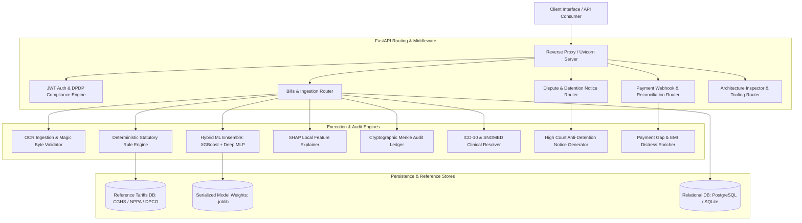
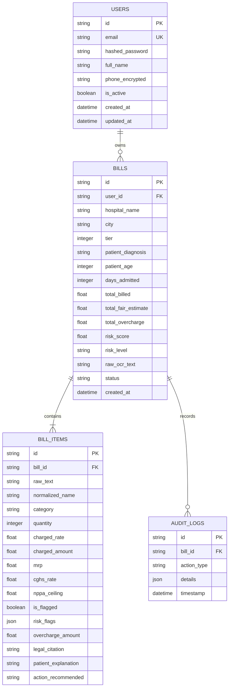
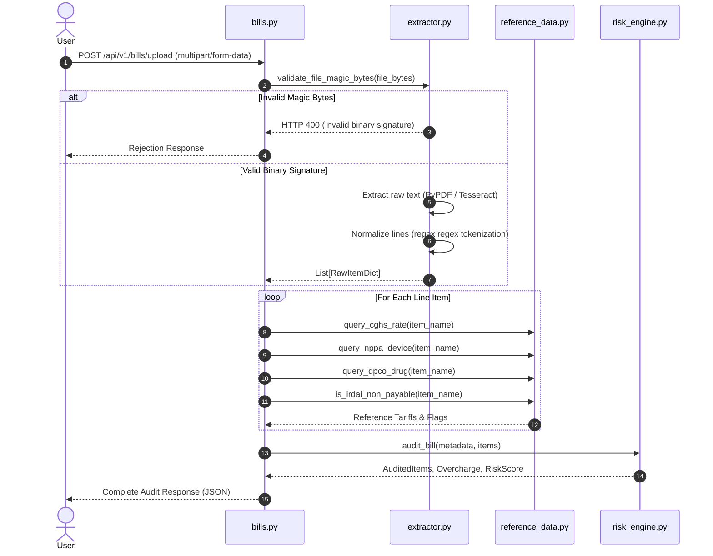
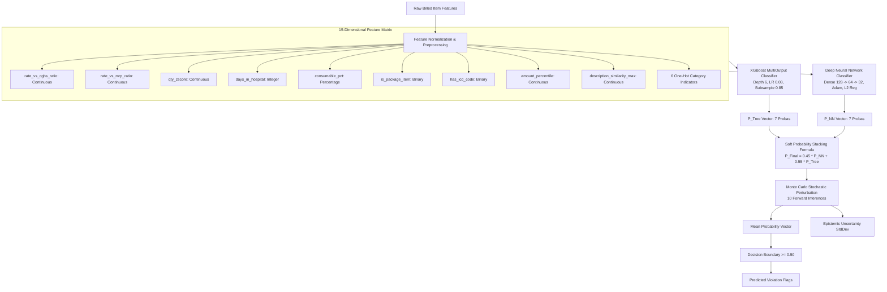
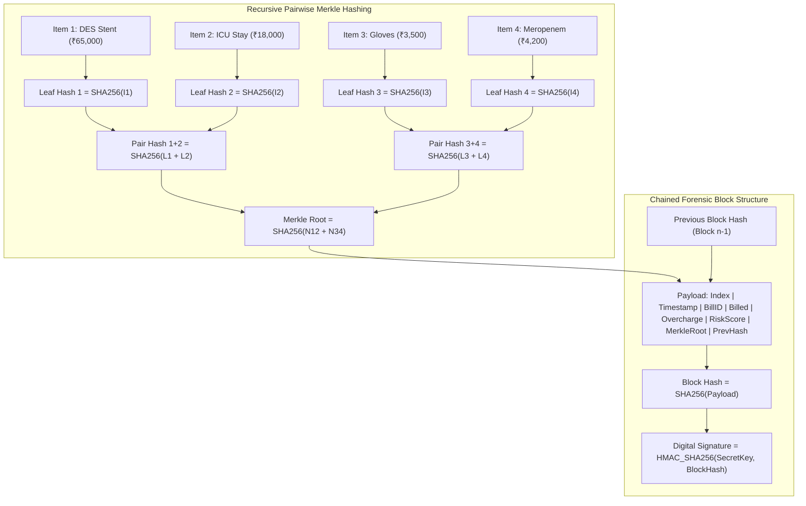
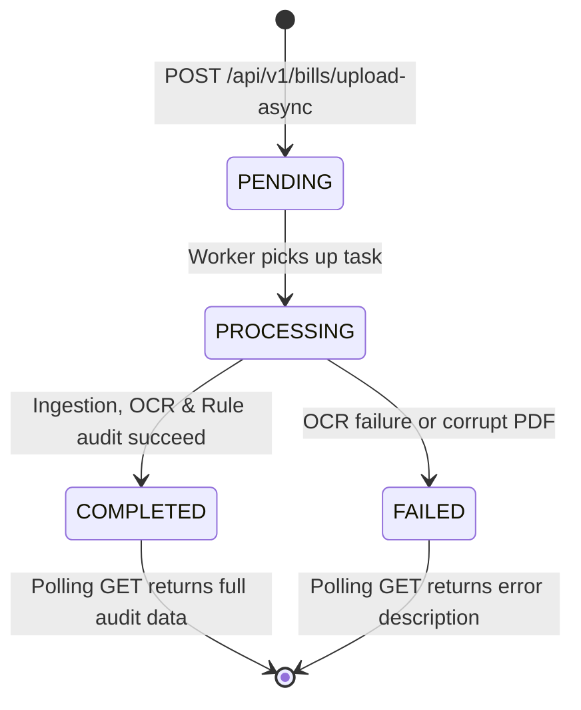

---
{
  "id": "file_16xv44iy",
  "filetype": "document",
  "filename": "ARCHITECTURE",
  "created_at": "2026-08-26T06:23:17.188Z",
  "updated_at": "2026-08-26T06:23:22.770Z",
  "meta": {
    "location": "/",
    "tags": [],
    "categories": [],
    "description": "",
    "source": "markdown"
  }
}
---

# CuraVeris Technical Architecture Specification

This document details the systems design, data pipelines, database models, machine learning ensemble, and cryptographic protocols of the CuraVeris platform.

---

## 1. System Architecture and Component Hierarchy

CuraVeris is designed as an asynchronous, layered service architecture.

---

## 2. Database Schema and Entity-Relationship Architecture

The relational persistence tier tracks user identity, bill audit lifecycle states, and individual line items with foreign key constraints.

### 2.1 Table Definitions

- **`users`**: Manages credentials and contact numbers. Contact numbers are stored encrypted using AES-256-GCM. Anonymization under DPDP Act 2023 replaces personal details with pseudonymous hashes.
- **`bills`**: Root entity for an audit session. Stores gross financial totals, composite risk scores, and patient demographic indicators.
- **`bill_items`**: Atomic line items extracted from the bill. Retains comparisons against statutory rate schedules, specific violation flags, and granular overcharge sums.
- **`audit_logs`**: System audit trail capturing changes, status transitions, and forensic report generations.

---

## 3. Optical Character Recognition and Ingestion Pipeline

The ingestion pipeline converts untrusted user uploads into validated, normalized line item entities.

---

## 4. Machine Learning Ensemble Architecture

The machine learning subsystem implements a hybrid stacking strategy, combining gradient-boosted decision trees with a multi-layer perceptron neural network.

### 4.1 Feature Definitions

1. **`rate_vs_cghs_ratio`**: Ratio of billed rate to statutory CGHS benchmark rate.
2. **`rate_vs_mrp_ratio`**: Ratio of billed rate to statutory DPCO/MRP ceiling.
3. **`qty_zscore`**: Z-score of charged quantity relative to standard clinical item consumption.
4. **`days_in_hospital`**: Total length of stay in days.
5. **`consumable_pct`**: Ratio of consumable bill total to gross invoice amount.
6. **`is_package_item`**: Binary indicator whether the item is part of a bundled procedure package.
7. **`has_icd_code`**: Binary indicator whether a valid diagnostic code is attached.
8. **`amount_percentile`**: Percentile rank of charged line amount within the bill.
9. **`description_similarity_max`**: Maximum string similarity score to any other item in the bill.
10. **`cat_*`**: One-hot indicators across 6 primary clinical categories (`procedure`, `pharmacy`, `investigation`, `consumable`, `room_nursing`, `tax_gst`).

### 4.2 Mathematical Formulas

#### Soft Voting Equation:

$$P_j = 0.45 \cdot P_{\text{NN}, j} + 0.55 \cdot P_{\text{XGB}, j} \quad \forall j \in \{1 \dots 7\}$$

#### Monte Carlo Epistemic Uncertainty:

$$\mu_j = \frac{1}{K} \sum_{k=1}^{K} P_{j}^{(k)}, \quad \sigma_j = \sqrt{\frac{1}{K} \sum_{k=1}^{K} \left(P_{j}^{(k)} - \mu_j\right)^2}$$
Where $K = 10$ passes with stochastic input perturbation.

---

## 5. Cryptographic Merkle Audit Ledger Specification

The forensic audit ledger guarantees evidence integrity for legal admissibility under Section 65B of the Indian Evidence Act.

### 5.1 Algorithmic Guarantees

- **Tamper Evident**: Modifying an item amount from ₹3,500 to ₹1,500 alters Leaf Hash 3, propagating to Pair Hash 3+4, which invalidates the Merkle Root and causes `verify_integrity()` to fail.
- **Authenticity Guaranteed**: Origin signature is computed via HMAC-SHA256 using the platform's root key.

---

## 6. Asynchronous Background Task State Machine

Large bills with high-resolution scans are handled through asynchronous task queues using FastAPI's `BackgroundTasks`.

---

## 7. Security and Encryption Controls

1. **At-Rest Field Encryption**: Phone numbers and sensitive patient identifiers use AES-256 in Galois/Counter Mode (GCM), ensuring both confidentiality and integrity authentication.
2. **Access Control**: Stateless JSON Web Tokens (JWT) signed via HMAC-SHA256. Expire after 1,440 minutes (24 hours).
3. **Data Protection (DPDP Act 2023)**:
   - Calling `POST /api/v1/auth/anonymize-me` permanently sanitizes user personal identifying information and swaps primary records with one-way cryptographic hashes.
