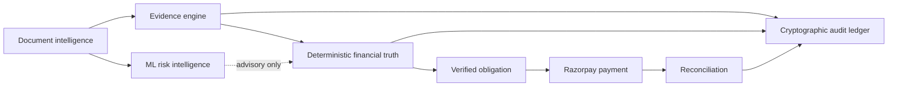
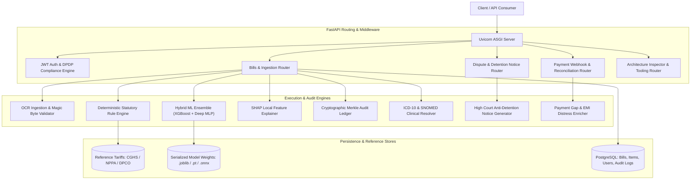
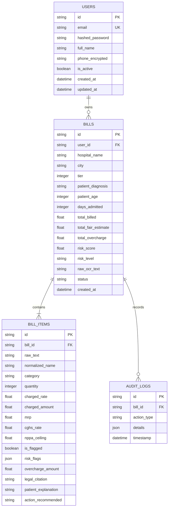
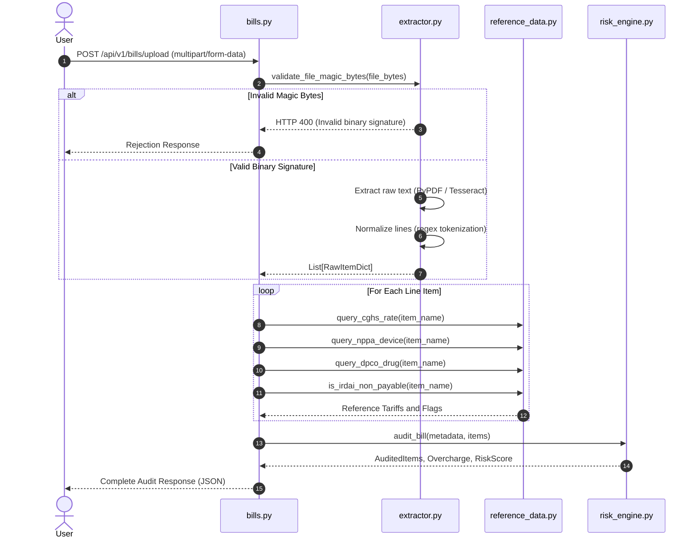
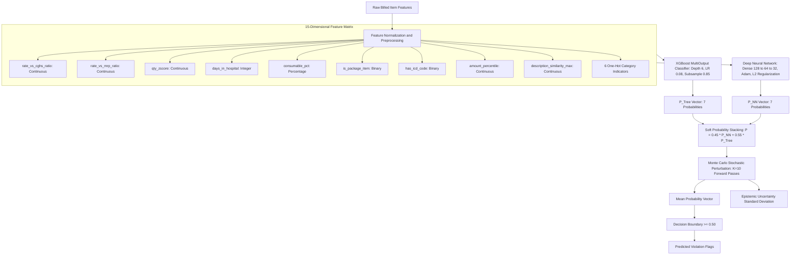
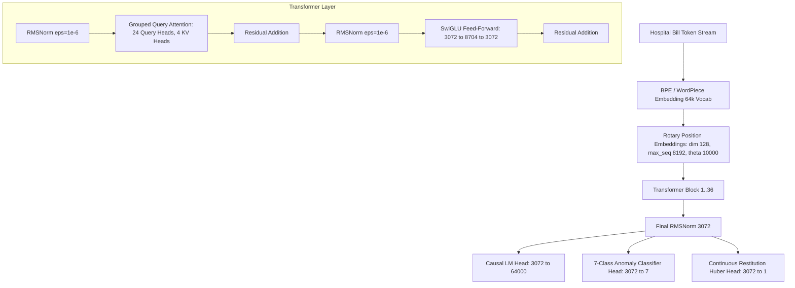
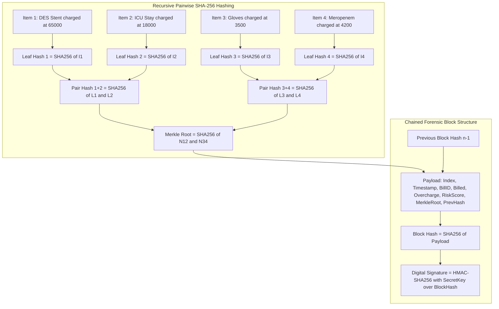
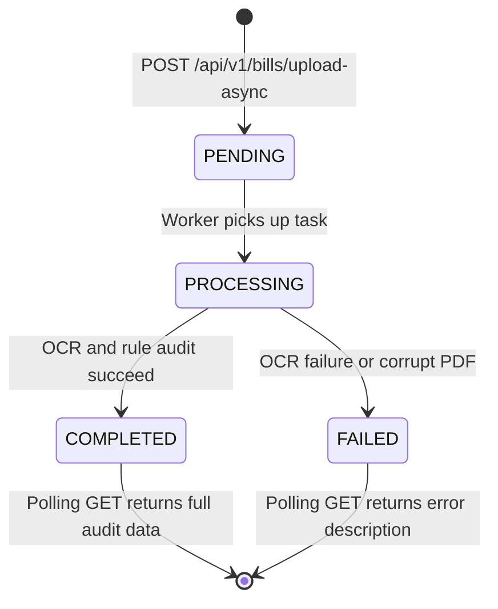
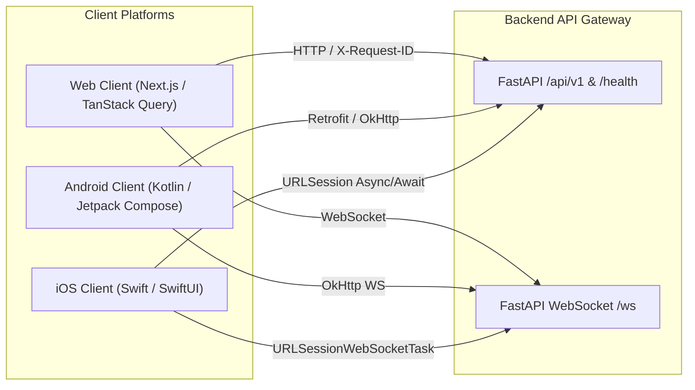
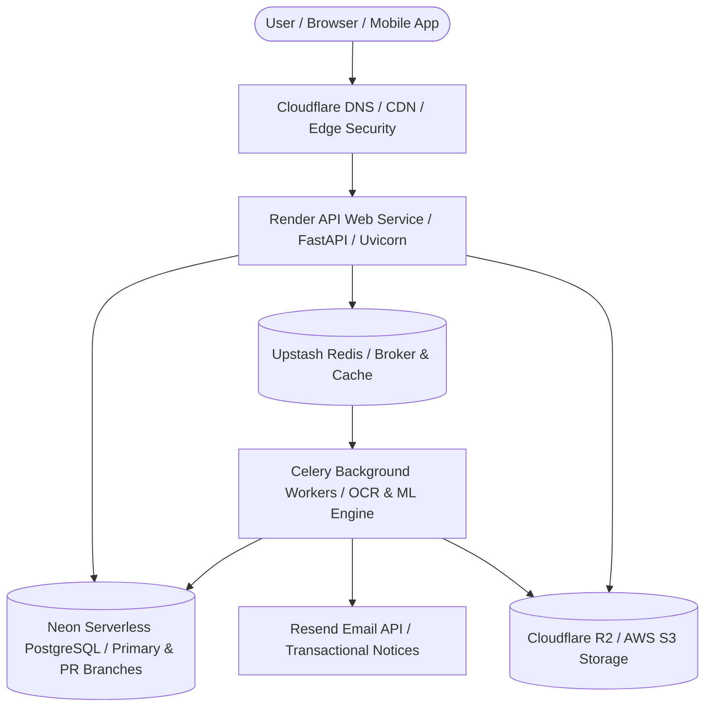

# CuraVeris Technical Architecture Specification

This document details the systems design, data pipelines, database schema, machine learning ensemble, and cryptographic protocols of the CuraVeris platform.

> **Architecture Design Principles**: Document intelligence extracts evidence; the ML risk layer identifies anomalies; the deterministic financial-truth engine calculates liability; the evidence engine explains it; Razorpay executes payment; reconciliation compares expected and actual movement; the audit ledger preserves integrity. ML and narrative systems must not change a verified amount.

## Current → target migration path

| Current capability | Target refinement | Compatibility approach |
|---|---|---|
| `RiskAuditEngine` produces deterministic and ML audit material | `MLRiskEngine` supplies a stable advisory inference contract | Wrap existing XGBoost/MLP/ensemble artifacts; do not retrain or replace them |
| `ReconciliationEngine` calculates legacy four-way reconciliation | `FinancialTruthEngine` calculates verified obligation from documented contributions | Add the pure service alongside existing endpoints; preserve legacy status/output contracts |
| Extraction and audit data carry source fragments | `EvidenceEngine` creates explicit source → calculation → result chains | Add evidence contracts first, then persist with an additive migration |
| Razorpay order endpoint accepts invoice and amount | `PaymentOrchestrator` accepts a persisted verified obligation | Add a compatibility endpoint or optional obligation reference before retiring no API |
| `Payment`/`Reconciliation` tables store lifecycle fragments | obligation, contribution, timeline and resolution entities | Use additive migrations; do not alter legacy bill/payment tables destructively |

---

## Table of Contents

- [System Architecture](#1-system-architecture-and-component-hierarchy)
- [Database Schema](#2-database-schema-and-entity-relationship-architecture)
- [Ingestion Pipeline](#3-optical-character-recognition-and-ingestion-pipeline)
- [Machine Learning Ensemble](#4-machine-learning-ensemble-architecture)
- [Cryptographic Merkle Ledger](#5-cryptographic-merkle-audit-ledger-specification)
- [Async Task State Machine](#6-asynchronous-background-task-state-machine)
- [Security Controls](#7-security-and-encryption-controls)

---

## 1. System Architecture and Component Hierarchy

CuraVeris is structured as an asynchronous layered service architecture with strict separation between ingestion, auditing, persistence, and document generation responsibilities.

---

## 2. Database Schema and Entity-Relationship Architecture

The relational persistence tier uses PostgreSQL for all transactional data. The SQLite reference store is read-only and seeded at startup from statutory gazette data.

### 2.1 Table Definitions

- **`users`**: Manages credentials and contact numbers. Phone numbers are stored encrypted using AES-256-GCM. DPDP Act 2023 anonymization replaces personal identifying information with one-way cryptographic hashes.
- **`bills`**: Root entity for an audit session. Stores gross financial totals, composite risk scores, and patient demographic indicators.
- **`bill_items`**: Atomic line items extracted from the bill. Retains statutory rate comparisons, specific violation flags, and granular overcharge sums.
- **`audit_logs`**: System audit trail capturing status transitions, forensic report generations, and operator actions.

---

## 3. Optical Character Recognition and Ingestion Pipeline

The ingestion pipeline converts untrusted user uploads into validated, normalized line item entities before any audit computation begins.

### 3.1 File Validation Controls

Pre-ingestion validation inspects binary magic bytes to prevent polyglot payload execution:

- PDF files: magic bytes `%PDF-` (`0x25 0x50 0x44 0x46 0x2D`)
- PNG files: magic bytes `\x89PNG` (`0x89 0x50 0x4E 0x47`)
- JPEG files: magic bytes `\xFF\xD8\xFF`

Files that do not match their declared content type are rejected before any OCR processing occurs.

---

## 4. Machine Learning Ensemble Architecture

The ML subsystem implements a hybrid stacking strategy, combining gradient-boosted decision trees with a multi-layer perceptron neural network across 7 violation labels simultaneously.

### 4.1 Feature Definitions

| Index | Feature | Type | Description |
| :--- | :--- | :--- | :--- |
| 1 | `rate_vs_cghs_ratio` | Continuous | Billed rate divided by CGHS statutory benchmark rate |
| 2 | `rate_vs_mrp_ratio` | Continuous | Billed rate divided by DPCO MRP ceiling |
| 3 | `qty_zscore` | Continuous | Z-score of charged quantity vs. clinical norm |
| 4 | `days_in_hospital` | Integer | Total inpatient length of stay |
| 5 | `consumable_pct` | Percentage | Consumable subtotal as a fraction of gross bill |
| 6 | `is_package_item` | Binary | Item is part of a bundled procedure package |
| 7 | `has_icd_code` | Binary | Valid ICD-10 diagnostic code is attached |
| 8 | `amount_percentile` | Continuous | Percentile rank of line amount within the bill |
| 9 | `description_similarity_max` | Continuous | Maximum string similarity to any other line item |
| 10-15 | `cat_*` | Binary (one-hot) | `procedure`, `pharmacy`, `investigation`, `consumable`, `room_nursing`, `tax_gst` |

### 4.2 Mathematical Specification

**Soft voting**:

$$P_j = 0.45 \cdot P_{\text{NN}, j} + 0.55 \cdot P_{\text{XGB}, j} \quad \forall\, j \in \{1 \dots 7\}$$

**Monte Carlo uncertainty**:

$$\mu_j = \frac{1}{K} \sum_{k=1}^{K} P_{j}^{(k)}, \qquad \sigma_j = \sqrt{\frac{1}{K} \sum_{k=1}^{K} \left(P_{j}^{(k)} - \mu_j\right)^2}, \qquad K = 10$$

**Confidence thresholds**:

| Classification | Condition |
| :--- | :--- |
| `HIGH_CONFIDENCE_VIOLATION` | $\mu \ge 0.55$, $\sigma \le 0.04$ |
| `AMBIGUOUS_BORDERLINE_REVIEW` | $\mu \ge 0.40$, $\sigma > 0.06$ |
| `CONFIDENT_COMPLIANT` | $\mu < 0.35$, $\sigma \le 0.04$ |

### 4.3 Modular Production ML Pipelines (`app/ml/pipelines/`)

The platform structures ML and audit processing into 7 modular, decoupled pipelines for sub-100ms mobile client inference:

1. **`DocumentParsingPipeline`**:
   - LayoutLMv3 multimodal token classification on bounding boxes normalized to $[0, 1000]$.
   - Extracts 15 NER billing entities (`HOSPITAL_NAME`, `BILL_DATE`, `ITEM_NAME`, `QTY`, `UNIT_PRICE`, `TOTAL_AMOUNT`, `GST_AMOUNT`, etc.).
2. **`StatutoryRAGPipeline`**:
   - ChromaDB BioBERT semantic vector store (768 dimensions) querying statutory tables: `cghs_collection`, `nppa_collection`, `dpco_collection`.
   - Threshold-gated retrieval (cosine similarity $> 0.72$) for exact schedule matching.
3. **`XGBoostRiskPipeline`**:
   - Multi-label gradient boosted trees on 10 canonical features.
   - SMOTE minority oversampling and calibrated decision thresholds (`optimal_thresholds.json`).
4. **`DeepEnsembleRiskPipeline`**:
   - 3-layer deep MLP combined with XGBoost via soft stacking.
   - 15-pass Monte Carlo Dropout epistemic uncertainty scoring ($\sigma$).
5. **`InsuranceReconciliationPipeline`**:
   - Analyzes TPA claim settlement deductions against IRDAI 2016/2019 Master Circular schedules.
   - Categorizes non-payable items into mandatory exclusions vs recoverable medical charges.
6. **`LegalDisputePipeline`**:
   - Compiles statutory violation findings into legally binding dispute letters citing the Consumer Protection Act 2019, DPCO 2013, and Essential Commodities Act 1955.
7. **`MobileInferencePipeline`**:
   - Unified mobile gateway returning compact, high-speed JSON payloads with UI color badges (`#10B981`, `#F59E0B`, `#EF4444`), risk scores (0–100), and downloadable legal notices.

---

### 4.4 Memory-Efficient Single-Pass Parallel Model Training (`backend/ml_training/train_all_models.py`)

For multi-model training under tight memory limits (< 8GB RAM peak), the parallel trainer executes a single-pass streaming architecture:

- **`StreamingBillLoader`**: Iterates through `merged_dataset.jsonl` in 64-bill chunks with explicit garbage collection and 32-bit CRC hash splitting (70% train, 15% val, 15% test).
- **`FeatureExtractor`**: Pre-loads lightweight SQLite lookup dictionaries (~8MB RAM) and processes each bill once for all 3 models simultaneously.
- **`XGBoostTrainer` (Model A)**: Memory-maps feature arrays to disk (`tmp/X_train.mmap`, `tmp/y_train.mmap`), applies SMOTE per label, and fits multi-label classifiers without RAM exhaustion.
- **`LayoutLMTrainer` (Model B)**: Background worker thread with bounded task queue (`queue.Queue(maxsize=100)`), gradient checkpointing, and early stopping.
- **`ChromaIndexer` (Model C)**: Buffers text in 32-item batches, embeds with BioBERT, and writes directly to persistent ChromaDB vector storage.

---

### 4.5 CuraVeris-4B & CuraVeris-1B Custom Transformer Architecture

For domain-native clinical and statutory reasoning, CuraVeris implements custom dense Transformer architectures built from scratch:

- **CuraVeris-4B Specs**: 36 Layers, $d_{\text{model}}=3072$, $d_{\text{ff}}=8704$, 24 Query Heads, 4 KV Heads (6x GQA Compression), 64,000 Vocab, ~4.07B Parameters.
- **CuraVeris-1B Specs**: 24 Layers, $d_{\text{model}}=1792$, $d_{\text{ff}}=4864$, 14 Query Heads, 2 KV Heads (7x GQA Compression), 64,000 Vocab, ~1.05B Parameters.
- **Multi-Task Objective**:
  $$\mathcal{L}_{\text{total}} = \mathcal{L}_{\text{LM}} + 0.5 \cdot \mathcal{L}_{\text{Focal}} + 0.1 \cdot \mathcal{L}_{\text{Huber}}$$

---

## 5. Cryptographic Merkle Audit Ledger Specification

The forensic audit ledger guarantees evidence integrity for legal admissibility under Section 65B of the Indian Evidence Act and Bharatiya Sakshya Adhiniyam Section 61.

### 5.1 Hash Formulas

**Leaf hash**:

$$\text{Leaf}_i = \text{SHA-256}(\text{RawText} \parallel \text{ChargedRate} \parallel \text{Quantity} \parallel \text{OverchargeAmount})$$

**Block hash**:

$$\text{Block}_n = \text{SHA-256}(n \parallel \text{Timestamp} \parallel \text{BillID} \parallel \text{TotalBilled} \parallel \text{Overcharge} \parallel \text{RiskScore} \parallel \text{MerkleRoot} \parallel \text{PrevHash})$$

**Origin signature**:

$$\text{Signature} = \text{HMAC-SHA256}(k_{\text{secret}},\; \text{Block}_n)$$

### 5.2 Tamper Detection

Modifying any item amount — for example, reducing a glove charge from ₹3,500 to ₹1,500 — alters Leaf Hash 3, which cascades to Pair Hash 3+4, invalidating the Merkle Root. The `verify_integrity()` function will reject the certificate with a hash mismatch error. HMAC verification will also independently fail if the block hash was manually reconstructed.

---

## 6. Asynchronous Background Task State Machine

Large bills with high-resolution scans are handled through FastAPI's `BackgroundTasks` queue to prevent request timeout on the synchronous ingestion path.

State transitions are persisted to the `bills.status` column in PostgreSQL and the full transition history is appended to `audit_logs`.

---

## 7. Security and Encryption Controls

1. **At-rest field encryption**: Patient phone numbers and sensitive identifiers use AES-256 in Galois/Counter Mode (GCM), providing both confidentiality and integrity authentication.
2. **Access control**: Stateless JSON Web Tokens signed via HMAC-SHA256. Expire after 1,440 minutes (24 hours). No server-side session state is maintained.
3. **Password storage**: bcrypt with cost factor 12. Salted at write time, verified at login. Plaintext is never persisted.
4. **File ingestion defense**: Binary magic bytes validation rejects polyglot payloads before any OCR execution.
5. **Webhook integrity**: Razorpay HMAC-SHA256 signature verification is mandatory before any payment status transition.
6. **DPDP Act 2023, Section 12**: Right to erasure implemented at `POST /api/v1/auth/anonymize-me`. Replaces personal details with `DPDP_Anonymized_Patient_<SHA256_HASH>` pseudonyms.

See [`SECURITY.md`](./SECURITY.md) for the complete threat model and control mapping.

---

## 8. Multi-Platform Client Tier

CuraVeris provides unified, native client foundations across Web, Android, and iOS communicating with the canonical FastAPI REST API and WebSocket events:

### Client Architecture Details

| Platform | Location | Core Technologies | Key Capabilities |
| :--- | :--- | :--- | :--- |
| **Web** | `clients/web/` | Next.js 14, React 18, TanStack Query v5, TypeScript | Responsive glassmorphism shell, `X-Request-ID` tracing, JWT auto-refresh, real-time WebSocket subscriber, error boundaries, and offline reachability detection. |
| **Android** | `clients/android/` | Kotlin 1.9, Jetpack Compose, Material 3, OkHttp | AndroidX `EncryptedSharedPreferences` (AES256-GCM Keystore), `ConnectivityManager` StateFlow reachability, document picker contracts, notification channels for statutory alerts, and `curaveris://` deep linking. |
| **iOS** | `clients/ios/` | Swift 5.0, SwiftUI, Foundation, Security | iOS Keychain Services (`kSecClassGenericPassword`), `URLSession` async/await, `NWPathMonitor` reachability, `UNUserNotificationCenter` statutory alert manager, `UIDocumentPickerViewController`, and universal deep link routing. |

---

## 9. Distributed Infrastructure & Cloud Native Topology

### 1. Database Tier: Neon Serverless PostgreSQL
- **Connection Pooling**: Managed via `ep-placeholder-pooler.c-4.us-east-2.aws.neon.tech` with async SQLAlchemy 2.0 (`asyncpg` driver).
- **PR Database Branching**: Integrated via GitHub Actions (`neondatabase/create-branch-action@v6`) allowing instant zero-copy schema forks for each pull request.

### 2. Message Broker & Background Tasks: Upstash Redis & Celery
- **Broker**: Managed Redis with TLS (`rediss://`).
- **Queues**: Dedicated queues for `bill_processing`, `notifications`, and `default`.
- **Result Backend**: Stored securely in PostgreSQL backend tables.

### 3. Notification & Storage Pipelines: Resend & Object Storage
- **Email Delivery**: High-deliverability transactional audit reports and dispute notices dispatched via Resend REST API.
- **Document Store**: S3-compatible encrypted cloud storage for incoming medical invoices and generated Section 65B legal petitions.

