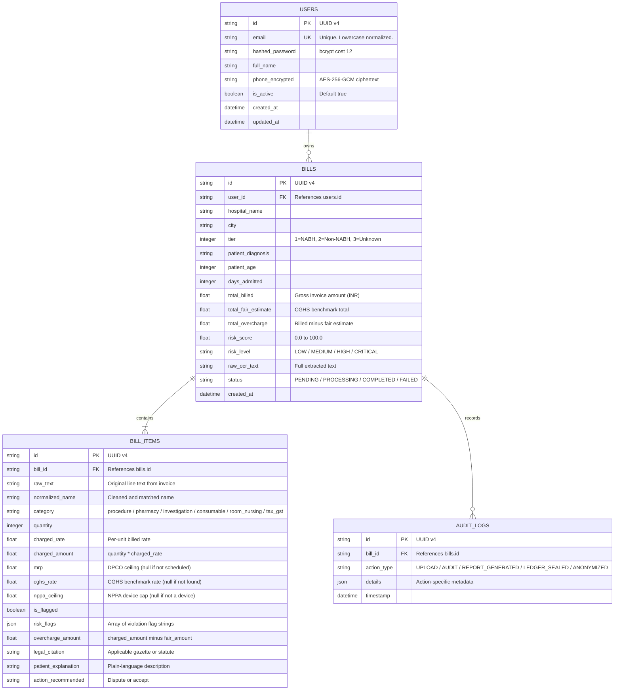

# CuraVeris Data Model

This document specifies the persistence architecture, entity definitions, field-level descriptions, and reference data structure of the CuraVeris platform.

---

## Table of Contents

- [Persistence Strategy](#1-persistence-strategy)
- [Entity-Relationship Overview](#2-entity-relationship-overview)
- [PostgreSQL Entities](#3-postgresql-entities)
- [SQLite Reference Store](#4-sqlite-statutory-reference-store)
- [Field-Level Encryption](#5-field-level-encryption)
- [DPDP Anonymization Model](#6-dpdp-anonymization-model)

---

## 1. Persistence Strategy

CuraVeris uses a two-tier persistence model:

| Store | Engine | Purpose |
| :--- | :--- | :--- |
| PostgreSQL 14+ | Async SQLAlchemy (asyncpg) | All transactional and audit data. ACID guarantees. |
| SQLite | Synchronous SQLite3 | Read-only statutory rate lookup tables seeded at startup. |
| In-memory | Python dict / TF-IDF index | BM25 and TF-IDF semantic procedure search. Not persisted. |
| Filesystem | `.joblib` | Serialized ML model weights. Loaded at startup. |

SQLite is the reference-only store. It is never written to during application operation. PostgreSQL holds all user data, bill records, audit results, and system logs.

---

## 2. Entity-Relationship Overview



---

## 3. PostgreSQL Entities

### 3.1 `users`

Stores account credentials and contact data. Phone numbers are encrypted before write. Email is treated as the unique identity key.

**DPDP erasure behavior**: `POST /api/v1/auth/anonymize-me` sets `email`, `full_name`, and `phone_encrypted` to irreversible pseudonyms. The account row is retained for audit log integrity but contains no personally identifiable information.

### 3.2 `bills`

The root audit session entity. One `bill` record per uploaded invoice. All financial aggregates — gross total, fair estimate total, and overcharge total — are computed from child `bill_items` at write time and denormalized for query performance.

**Status transitions**:

```text
PENDING --> PROCESSING --> COMPLETED
                      \--> FAILED
```

Async uploads create a record in `PENDING` state immediately. Synchronous uploads complete the entire pipeline in a single request before returning `COMPLETED`.

### 3.3 `bill_items`

One row per extracted line item from the invoice. Contains both the raw OCR text and the normalized, matched name after semantic search. Statutory comparisons (`cghs_rate`, `nppa_ceiling`, `mrp`) are `NULL` when no reference match was found.

**Violation flags** (stored as a JSON array):

| Flag | Statute |
| :--- | :--- |
| `above_mrp` | DPCO 2013, Para 24 |
| `nppa_ceiling_violation` | NPPA S.O. 1335(E) or S.O. 2668(E) |
| `cghs_excess` | CGHS 2024 procedure rate schedules |
| `duplicate_charge` | Shadow bill detection |
| `room_rent_ratio_violation` | IRDAI room rent proportionality rules |
| `gst_on_exempt` | MoF Notification 12/2017-CT(R), Entry 74 |
| `consumable_unbundled` | IRDAI Circular 2020, 199-item list |
| `mental_healthcare_act_violation` | MHA 2017, Section 21(4) |
| `pmjay_cash_violation` | NHA Guidelines Section 3.2 |

### 3.4 `audit_logs`

Append-only system audit trail. No record is ever updated or deleted. Used to reconstruct the complete operational history of any bill record for forensic purposes.

---

## 4. SQLite Statutory Reference Store

The reference store is seeded at application startup from embedded statutory data. It is read-only during operation. All tables are indexed on the primary lookup key.

### 4.1 `cghs_rates`

| Column | Type | Description |
| :--- | :--- | :--- |
| `id` | INTEGER PK | Auto-increment |
| `procedure_name` | TEXT | Canonical CGHS procedure name |
| `icd_code` | TEXT | ICD-10 code where applicable |
| `nabh_rate` | REAL | CGHS approved rate for NABH-accredited hospitals |
| `non_nabh_rate` | REAL | CGHS approved rate for non-NABH hospitals |
| `category` | TEXT | Clinical category |

Source: CGHS 2024 Revised Rate List — 1,900+ procedures.

### 4.2 `nppa_devices`

| Column | Type | Description |
| :--- | :--- | :--- |
| `id` | INTEGER PK | Auto-increment |
| `device_name` | TEXT | Canonical device name |
| `device_type` | TEXT | `stent` or `knee_implant` |
| `ceiling_price` | REAL | Maximum allowable price in INR excluding GST |
| `gazette_reference` | TEXT | Gazette notification identifier |

### 4.3 `dpco_drugs`

| Column | Type | Description |
| :--- | :--- | :--- |
| `id` | INTEGER PK | Auto-increment |
| `drug_name` | TEXT | Scheduled formulation name |
| `strength` | TEXT | Strength and dosage form |
| `mrp_per_unit` | REAL | Maximum Retail Price per unit |

Source: DPCO 2013 Schedule I — 850+ scheduled formulations.

### 4.4 `irdai_non_payables`

| Column | Type | Description |
| :--- | :--- | :--- |
| `id` | INTEGER PK | Auto-increment |
| `item_name` | TEXT | Standardized consumable name |
| `category` | TEXT | Operational category |

Source: IRDAI Circular IRDA/HLT/REG/CIR/146/07/2020 — 199 items.

### 4.5 `disease_registry`

| Column | Type | Description |
| :--- | :--- | :--- |
| `id` | INTEGER PK | Auto-increment |
| `diagnosis_name` | TEXT | Clinical diagnosis description |
| `icd10_code` | TEXT | ICD-10-CM code |
| `snomed_code` | TEXT | SNOMED-CT concept identifier |
| `average_los_days` | INTEGER | Clinical Average Length of Stay benchmark |
| `pmjay_package_code` | TEXT | Corresponding PM-JAY HBP 2.2 package code |

---

## 5. Field-Level Encryption

Sensitive fields are encrypted at the application layer before PostgreSQL write. The database stores only ciphertext.

**Algorithm**: AES-256 in Galois/Counter Mode (GCM).

- Provides both confidentiality (encryption) and integrity authentication (GCM authentication tag).
- A unique 96-bit nonce is generated per write operation.
- The nonce is stored with the ciphertext in the format `nonce:ciphertext` (both hex-encoded).

**Encrypted fields**:

| Table | Field | Reason |
| :--- | :--- | :--- |
| `users` | `phone_encrypted` | Personal contact identifier under DPDP Act 2023 |

The encryption key is derived from the `SECRET_KEY` environment variable. Rotation requires re-encryption of all ciphertext fields and a new `SECRET_KEY` value.

---

## 6. DPDP Anonymization Model

When a user exercises their right to erasure under DPDP Act 2023 Section 12 via `POST /api/v1/auth/anonymize-me`:

1. A SHA-256 hash of the original email address is computed.
2. `users.email` is replaced with `DPDP_Anonymized_<SHA256_HASH>@anonymized.curaveris`.
3. `users.full_name` is replaced with `DPDP Anonymized Patient`.
4. `users.phone_encrypted` is replaced with an empty encrypted token.
5. `users.is_active` is set to `false`.
6. An `ANONYMIZED` record is appended to `audit_logs` with the timestamp.

Bill records and audit logs are retained. The financial audit data does not constitute personal data under the DPDP Act because it cannot be re-linked to the individual after anonymization.
