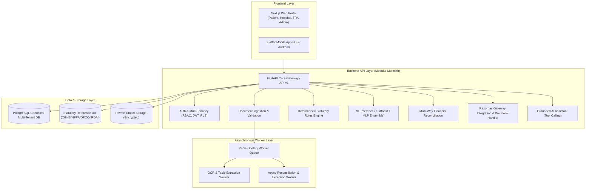

---
{
  "id": "file_xp1ab4r9",
  "filetype": "document",
  "filename": "ENGINEERING_AUDIT",
  "created_at": "2026-08-27T08:10:42.582Z",
  "updated_at": "2026-08-27T08:10:42.582Z",
  "meta": {
    "location": "/",
    "tags": [],
    "categories": [],
    "description": "",
    "source": "markdown"
  }
}
---
# CuraVeris — Comprehensive Engineering & Architectural Audit

**Document Version:** 1.0.0  
**Date:** August 27, 2026  
**Auditor:** Principal Architecture, Security, ML & DevOps Review  
**Repository:** `CuraVeris`

---

## 1. Executive Summary

CuraVeris was initiated as an automated medical billing audit and patient financial advocacy engine for the Indian healthcare system. It implements a core rule-based auditing engine referencing Indian statutory benchmarks (CGHS, NPPA price caps, DPCO NLEM drug ceilings, and IRDAI non-payable schedules), accompanied by an asynchronous OCR pipeline, an in-memory Merkle audit ledger, and a hybrid XGBoost/MLP model prototype.

However, the current codebase is primarily a single-tenant prototype with a monolithic FastAPI backend, missing frontend portals (Patient, Hospital, TPA/Insurer, Admin), missing mobile applications (Flutter), relying on synthetic/simulated telemetry in developer endpoints, lacking canonical multi-tenant database models, and lacking true multi-party financial reconciliation between hospitals, insurers/TPAs, and payment gateways.

This audit provides a factual, evidence-based inventory of what exists, what is partially implemented, what is mocked, what is broken, and outlines the production transformation strategy.

---

## 2. Current Architecture & Codebase Map

### 2.1 File & Directory Inventory

```
J:\Dev\PROJECTS\CuraVeris
├── backend/
│   ├── app/
│   │   ├── api/              # FastAPI routers (auth, bills, chat, dev, razorpay, etc.)
│   │   ├── core/             # Config, logging, rate limiter, security, Merkle ledger
│   │   ├── db/               # SQLAlchemy models (5 tables), SQLite/Postgres DB setup, reference data
│   │   ├── engine/           # Risk engine, extractor, reconciliation, AI explainer, ICD-10
│   │   ├── ml/               # Risk classifier, deep risk net, dataset generator, LayoutLM script
│   │   ├── models/           # Pydantic schemas
│   │   └── services/         # Razorpay service, Claude agent
│   ├── ml_training/          # ML experiments, synthetic generators, PyTorch 1B/4B model definitions
│   ├── tests/                # 16 Pytest suites covering backend units & APIs
│   └── workers/              # Celery/background task definitions
├── src/hospital_bill_ml/     # Synthetic bill generator, hard negatives, mutations
├── scripts/                  # Scraping utilities & reference data normalization
├── data/                     # Synthetic raw/processed datasets
├── reference_data/           # SQLite statutory database (medical_rates.db)
└── docs/                     # Static markdown documentation
```

---

## 3. Detailed Component Audit

### 3.1 Existing Functionality (Working & Sound)

1. **Deterministic Statutory Reference Checking (`backend/app/db/reference_data.py`, `backend/app/engine/risk_engine.py`):**
   - Direct querying against SQLite `reference_data/medical_rates.db` with seeded CGHS rates, NPPA gazette stent/knee implant ceilings, DPCO drug price caps, and IRDAI non-payable item lists.
   - Text fuzzy matching and item categorization.
   - Deterministic rule checks for: `nppa_ceiling_violation`, `above_mrp`, `cghs_multiplier_excess`, `unbundled_consumables`, `duplicate_charge`, `gst_on_exempt`.

2. **Basic Bill Parsing & Text Extraction (`backend/app/engine/extractor.py`):**
   - Validates file magic bytes (PDF, PNG, JPEG).
   - PyPDF text extraction and rule-based regex segmentation into bill sections.
   - Monetary number cleaning and OCR character confusion correction (`O` -> `0`, `l`/`I` -> `1`).

3. **PII Encryption & Token Security (`backend/app/core/security.py`):**
   - Fernet (AES-128-CBC + HMAC-SHA256) field-level encryption for patient names/phone numbers.
   - Bcrypt (cost factor 12) for password hashing with failed-login brute-force lockout.
   - JWT access & refresh token generation with HMAC-SHA256 signing.

4. **Cryptographic Merkle Audit Ledger (`backend/app/core/merkle_audit_ledger.py`):**
   - Computes pairwise leaf-to-root SHA-256 Merkle root across line items.
   - Creates tamper-evident block hashes with HMAC origin sealing.

5. **Basic Razorpay Webhook Verification (`backend/app/services/razorpay_service.py`):**
   - Validates `X-Razorpay-Signature` via HMAC-SHA256 comparison.

6. **Synthetic Bill Generation (`src/hospital_bill_ml/`, `backend/app/ml/dataset_generator.py`):**
   - Generates realistic multi-category hospital bill line items with controlled overcharge and anomaly rates.

---

### 3.2 Partially Implemented / Simplified Functionality

1. **Reconciliation Engine (`backend/app/engine/reconciliation.py`):**
   - *Current state:* Computes a simple 3-way subtraction: `total_billed - insurance_approved` vs `razorpay_paid`.
   - *Gap:* Does not track claim line-item level adjustments, co-pay clauses, deductibles, sub-limits, TPA settlement batches, UTR/bank references, or multiple partial payment attempts.

2. **Database Models (`backend/app/db/models.py`):**
   - *Current state:* Only 5 tables exist (`User`, `Bill`, `BillItem`, `PaymentReconciliation`, `DisputeLetter`).
   - *Gap:* No multi-tenancy (`Organization`, `Tenant`), no separation of `Patient`, `Hospital`, `TPA`, `InsuranceProvider`, no `Encounter`, `Invoice`, `Claim`, `Settlement`, `PaymentAttempt`, `ReconciliationException`, `AuditFinding`, or `ReferenceRule` entities.

3. **Asynchronous Processing (`backend/app/api/bills.py` - `/upload-async`):**
   - *Current state:* Uses in-memory Python dictionaries (`ASYNC_JOB_STORE = {}`) for background job status.
   - *Gap:* Job state is lost on server restart; no persistent queue/worker (Redis/Celery/BullMQ) backing.

4. **SHAP & Feature Explainability (`backend/app/engine/shap_explainer.py`):**
   - *Current state:* Implements heuristic linear attribution weights fallback when full TreeExplainer is unavailable.

5. **ABDM / ABHA Integration (`backend/app/api/abha.py`, `backend/app/engine/abdm_gateway.py`):**
   - *Current state:* Mocked endpoints that simulate OTP generation and consent verification against sandbox URLs.

---

### 3.3 Mocked / Synthetic Capabilities Requiring Clarification & Refactoring

1. **"CuraVeris-4B" and "CuraVeris-1B" Telemetry (`backend/app/api/dev.py`, `backend/ml_training/models/`):**
   - *Reality:* The repository contains PyTorch class definitions (`CuraVeris1BConfig`, `CuraVeris4BConfig`) but **no actual trained 1B or 4B billion-parameter model weights exist** (the repo has ~3MB XGBoost/MLP joblib files).
   - *Issue:* `dev.py` hardcodes synthetic telemetry ("4.07 Billion parameters", "Trained and Active", simulated memory allocations, fake latency graphs).
   - *Action:* Remove synthetic LLM claims from production surface. Retain the working tabular ML model (XGBoost + MLP ensemble) with honest model cards and measured metrics.

2. **Developer Observability Dashboard (`backend/app/api/dev.py`):**
   - *Reality:* Generates ~100KB of inline HTML/JS with simulated drift and synthetic training history.
   - *Action:* Replace with real Prometheus/OpenTelemetry metrics and clean API endpoints.

---

### 3.4 Missing Functionality (To Be Built)

1. **Frontend Applications:**
   - No web application exists in the repo (Next.js, React, TypeScript).
   - All 4 stakeholder portals (Patient, Hospital Finance, TPA/Insurer, Admin) must be created.
   - Accessible, WCAG-compliant design system with responsive layouts (mobile portrait/landscape, tablet, laptop, desktop).

2. **Mobile Application:**
   - No Flutter application exists for Android and iOS.
   - Mobile camera scanning, multi-page document upload, offline retry, and biometric auth need to be implemented.

3. **Canonical Financial Multi-Tenant Data Model:**
   - 35+ canonical entities with strict tenant isolation, immutable audit logs, and decimal-safe financial calculations.

4. **Complete Multi-Party Reconciliation & Exception Engine:**
   - Itemized reconciliation between Hospital Invoices, Insurance Claims, TPA Approvals, Razorpay Payments, Refunds, and Bank Settlements.
   - Exception queue for Finance Controllers with actionable resolution workflows.

5. **AI Assistant with Grounded Tool Calling:**
   - Contextual assistants for Patient, Hospital, and TPA using deterministic data retrieval tools.

---

## 4. Security & Compliance Review

| Area | Current State | Risk / Gap | Required Remediation |
| :--- | :--- | :--- | :--- |
| **Authentication** | JWT with bcrypt & in-memory lockout | In-memory lockout lost on restart; no refresh token rotation table; no MFA | Implement persistent token rotation & Redis-backed lockout |
| **Multi-Tenancy** | Single-tenant schema (no `org_id` on tables) | Severe risk of cross-tenant data leakage if multi-hospital data is added | Implement `tenant_id` / `org_id` foreign keys with Row Level Security (RLS) / tenant-scoped queries |
| **Object Storage** | Files processed in-memory or local disk | No secure private object storage (S3/GCS/MinIO) with pre-signed URLs | Implement private S3/MinIO bucket with expiring pre-signed URLs |
| **Authorization** | Role string on User (`patient`, `hospital_admin`) | No granular RBAC or resource-level authorization checks on endpoints | Implement declarative RBAC middleware with permission matrices |
| **Financial Accuracy** | Python `float` used for amounts in DB and logic | Floating-point rounding errors on decimal currency | Convert all monetary calculations and DB columns to `Decimal` / `NUMERIC(12, 2)` / integer paise |
| **Audit Trails** | Merkle ledger in-memory list (`self.blocks`) | Ledger wiped on application restart | Persist Merkle tree blocks to PostgreSQL audit log table |

---

## 5. ML Subsystem Audit

1. **Current Models:**
   - Multi-output XGBoost Classifier (`backend/app/ml/weights/risk_model.joblib`, 3.05 MB)
   - Deep MLP Network (`deep_risk_network.joblib`, 896 KB)
   - Stacking Ensemble (`hybrid_ensemble.joblib`, 3.28 MB)
   - LayoutLM fine-tuning script (`train_layoutlm.py`)
2. **Current Evaluation:**
   - Synthetic dataset generated with rule-based heuristics.
   - Need proper Model Card (`ml/MODEL_CARD.md`) and Dataset Card (`ml/DATASET_CARD.md`) with explicit train/val/test splits, PR-AUC, calibration curves, and uncertainty error bounds.
3. **Inference Latency:**
   - Models currently loaded synchronously on startup and at module import (`~9.8s` cold start). Needs lazy loading or optimized singleton initialization.

---

## 6. Recommended Migration & Architecture Plan



---

## 7. Audit Conclusion

The algorithmic foundation of CuraVeris (statutory reference auditing, fuzzy matching, and Merkle record hashing) is technically sound and should be **preserved**. 

The core transformation required:
1. Replace floating-point representations with **decimal-safe currency arithmetic**.
2. Expand the database into a **canonical multi-tenant schema** supporting Hospitals, TPAs, Patients, Invoices, Claims, Payments, and Exceptions.
3. Build the modern **Next.js responsive Web Portals** and **Flutter Mobile codebase**.
4. Upgrade the **Reconciliation Engine** to handle complex item-level 4-way settlements and automated exception management.
5. Provide **grounded AI assistant tools** without hallucinations or unverified legal assertions.
