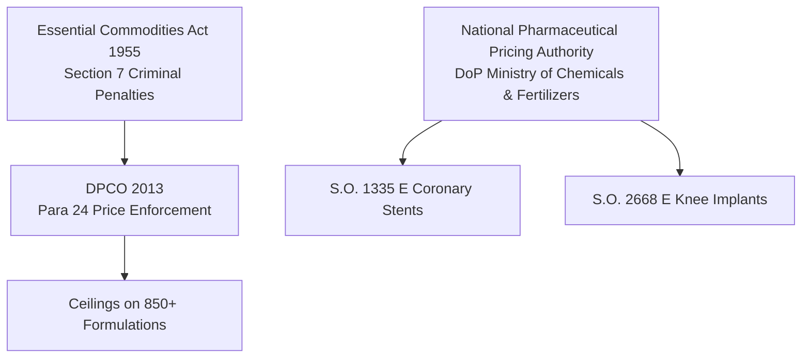
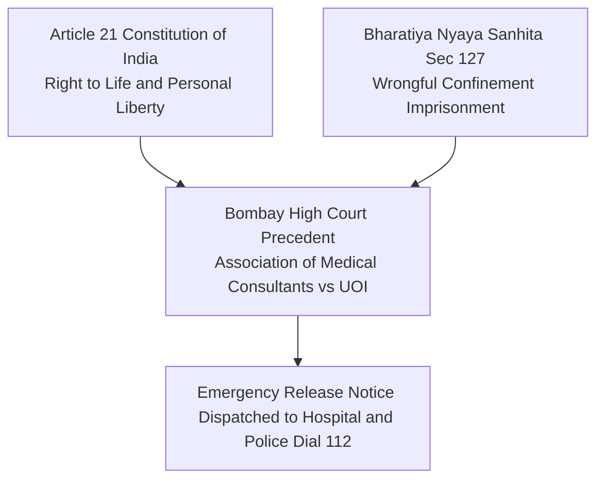

---
{
  "id": "file_95mp6xyn",
  "filetype": "document",
  "filename": "STATUTORY_FRAMEWORK",
  "created_at": "2026-08-26T06:23:06.504Z",
  "updated_at": "2026-08-26T06:23:27.698Z",
  "meta": {
    "location": "/",
    "tags": [],
    "categories": [],
    "description": "",
    "source": "markdown"
  }
}
---
# Indian Healthcare Statutory and Legal Enforcement Framework

This compendium documents the statutory acts, government price control orders, judicial precedents, and evidentiary standards implemented across the CuraVeris audit engine.

---

## 1. Drug and Implant Price Control Framework

### 1.1 Drugs (Prices Control) Order (DPCO) 2013
- **Statutory Authority**: Promulgated under Section 3 of the Essential Commodities Act (ECA), 1955.
- **Section 24 (Prohibition of Overcharging)**:
  > *"No person shall sell any formulation towards any consumer at a price exceeding the price specified in the current price list or price indicated on the label of the container or pack thereof, whichever is less."*
- **Penalties**: Violation of DPCO ceilings constitutes a cognizable offense under Section 7 of the Essential Commodities Act, 1955, attracting imprisonment of up to 7 years and recovery of overcharged amounts with penal interest.

### 1.2 NPPA Price Caps on Coronary Stents
- **Notification Reference**: Gazette Notification S.O. 1335(E).
- **Statutory Caps**:
  - Bare Metal Stents (BMS): Capped at ₹10,509 + applicable GST.
  - Drug-Eluting Stents (DES) and Biodegradable Stents: Capped at ₹38,260 + applicable GST.
- **Implementation in Code**: `backend/app/engine/risk_engine.py` directly flags any coronary stent charged above the NPPA statutory ceiling as `nppa_ceiling_violation` with mandatory credit note demands.

### 1.3 NPPA Price Caps on Orthopedic Knee Implants
- **Notification Reference**: Gazette Notification S.O. 2668(E).
- **Statutory Caps**:
  - Primary Knee Replacement System (Femoral & Tibial components): Capped at ₹63,800 + applicable GST.
  - Revision Knee Systems: Capped at ₹1,13,950 + applicable GST.

---

## 2. Tax and Billing Standardization Statutes

### 2.1 Goods and Services Tax (GST) Exemption on Healthcare
- **Statutory Notification**: Ministry of Finance Notification No. 12/2017-Central Tax (Rate), Entry 74 (Heading 9993).
- **Scope of Exemption**:
  > *"Services by way of: (a) health care services by a clinical establishment, an authorised medical practitioner or para-medics... are exempt from the whole of the central tax leviable thereon."*
- **Application in Audits**: Hospitals that add 18% GST surcharges on inpatient bed charges, doctor consultation fees, or surgical packages are in direct violation. CuraVeris extracts these lines, classifies them as `gst_on_exempt`, and reclaims the entire billed tax amount.

### 2.2 Clinical Establishments (Registration and Regulation) Act, 2010
- **Statutory Mandate**: Every clinical establishment is required to display standard tariff schedules in local languages, provide advance estimates prior to admission, and issue comprehensive daily itemized bills during inpatient stays.
- **Implementation**: The Inpatient Admission Monitor (`backend/app/engine/admission_monitor.py`) checks whether daily itemized billing obligations are respected.

### 2.3 IRDAI Standardization in Health Insurance (Circular 2020)
- **Reference**: IRDA/HLT/REG/CIR/146/07/2020.
- **List of Non-Payable Items**: IRDAI specifies 199 standard hospital consumable items (e.g., disposable gloves, face masks, sanitizers, thermometer covers) that are classified as operational overhead and must not be separately billed to patients or unbundled from base room tariffs.

---

## 3. Constitutional and Criminal Jurisprudence Against Patient Detention

### 3.1 Bombay High Court Landmark Precedent
- **Case Citation**: *Association of Medical Consultants vs Union of India & Ors.* (Criminal Writ Petition No. 2502 of 2000).
- **Ruling**:
  > *"Detention of any patient by any hospital on the ground of non-payment of hospital charges is totally illegal. Depriving a person of their personal liberty for recovery of financial dues violates Article 21 of the Constitution of India. No hospital or doctor has any legal lien over a human body or person."*
- **Delhi High Court Directives**: Reaffirmed in multiple rulings that withholding discharge summaries, clinical records, or physical bodies for unpaid balances is an unlawful act actionable under criminal law.

### 3.2 Bharatiya Nyaya Sanhita (BNS) 2023, Section 127
- **Successor Provision to**: Indian Penal Code (IPC) Sections 340 and 342.
- **Definition of Wrongful Confinement**:
  > *"Whoever wrongfully restrains any person in such a manner as to prevent that person from proceeding beyond certain circumscribing limits, is said 'wrongfully to confine' that person."*
- **Application**: The Emergency Detention Notice generator (`POST /api/v1/reports/emergency-detention-notice`) invokes Section 127, commanding immediate physical liberation within 30 minutes and simultaneously notifying the local Police Station House Officer (Dial 112) and District Magistrate.

---

## 4. Statutory Mental Health Parity

### 4.1 Mental Healthcare Act, 2017 (Section 21(4))
- **Statutory Text**:
  > *"Every insurer shall make provision for medical insurance for treatment of mental illness on the same basis as is available for treatment of physical illness."*
- **Enforcement**: IRDAI Circular Ref: IRDAI/HLT/MISC/CIR/128/06/2020 directed all general and standalone health insurance companies to comply. Denials, arbitrary exclusions, or lower sub-limits on psychiatric hospitalizations are flagged as `mental_healthcare_act_violation`.

---

## 5. Ayushman Bharat PM-JAY Compliance Mandates

### 5.1 National Health Authority (NHA) Operational Guidelines Section 3.2
- **Rule**: Empanelled healthcare providers (EHCP) are under statutory obligation to offer 100% cashless healthcare for 1,949 Health Benefit Packages (HBP 2.2).
- **Prohibition**: Hospitals are strictly barred from collecting any out-of-pocket payments from beneficiaries.
- **Penalty Scheme**:
  - Mandatory refund of the collected sum.
  - Imposition of a fine equal to 5 times the illegal cash amount collected.
  - De-empanelment of the hospital establishment and referral to State Anti-Fraud Units (SAFU).
- **Implementation in Code**: Implemented in `backend/app/api/bills.py` under endpoint `POST /api/v1/bills/pmjay-audit`.

---

## 6. Evidentiary Standards for Electronic Records

### 6.1 Indian Evidence Act Section 65B / Bharatiya Sakshya Adhiniyam Section 61
- **Legal Prerequisite**: Electronic records (such as system-generated audit tallies) are legally admissible in civil and consumer court proceedings only when accompanied by cryptographic proof that the data was generated in the ordinary course of system activity and remained free from post-hoc tampering.
- **CuraVeris Architecture**: The Cryptographic Merkle Audit Ledger (`backend/app/core/merkle_audit_ledger.py`) calculates deterministic SHA-256 hash chains and HMAC-SHA256 signatures over all audited items, fulfilling the strict criteria of Section 65B certificates.
