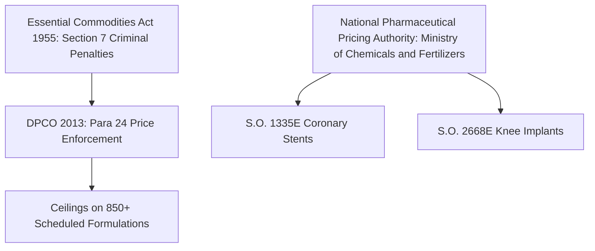
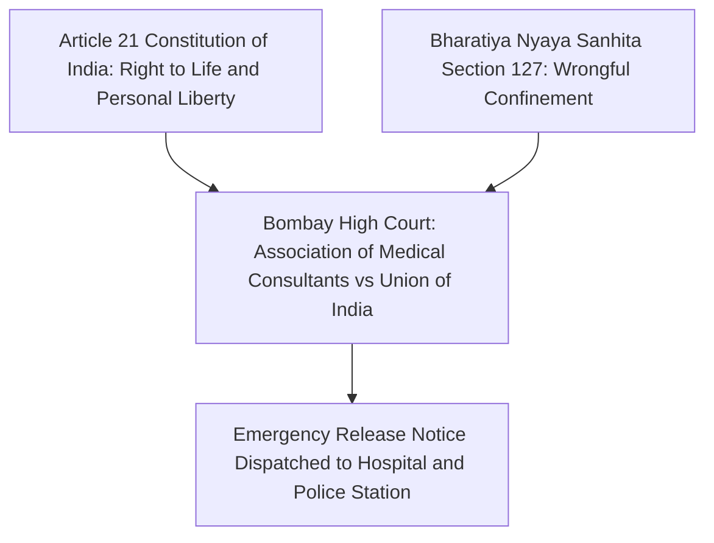
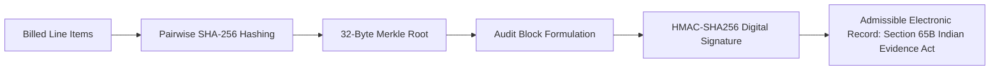

# Indian Healthcare Statutory and Legal Enforcement Framework

This document catalogues the statutory acts, government price control orders, judicial precedents, and evidentiary standards implemented across the CuraVeris audit engine.

---

## Table of Contents

- [Drug and Implant Price Control](#1-drug-and-implant-price-control-framework)
- [Tax and Billing Statutes](#2-tax-and-billing-standardization-statutes)
- [Anti-Detention Jurisprudence](#3-constitutional-and-criminal-jurisprudence-against-patient-detention)
- [Mental Health Parity](#4-statutory-mental-health-parity)
- [PM-JAY Compliance](#5-ayushman-bharat-pm-jay-compliance-mandates)
- [Evidentiary Standards](#6-evidentiary-standards-for-electronic-records)

---

## 1. Drug and Implant Price Control Framework

### 1.1 Drugs (Prices Control) Order (DPCO) 2013

- **Statutory authority**: Promulgated under Section 3 of the Essential Commodities Act (ECA), 1955.
- **Section 24 (Prohibition of Overcharging)**:
  > *"No person shall sell any formulation towards any consumer at a price exceeding the price specified in the current price list or price indicated on the label of the container or pack thereof, whichever is less."*
- **Penalties**: Violation of DPCO ceilings is a cognizable offense under Section 7 of the ECA, 1955. Punishment: imprisonment up to 7 years, plus recovery of overcharged amounts with penal interest.
- **Implementation**: `backend/app/engine/risk_engine.py` flags any drug billed above its gazette MRP as `above_mrp`.

### 1.2 NPPA Price Caps on Coronary Stents

- **Notification**: Gazette Notification S.O. 1335(E).
- **Caps**:
  - Bare Metal Stents (BMS): ₹10,509 + applicable GST
  - Drug-Eluting Stents (DES) and Biodegradable Stents: ₹38,260 + applicable GST
- **Implementation**: Any stent billed above the gazette ceiling is flagged as `nppa_ceiling_violation` with a mandatory credit note demand.

### 1.3 NPPA Price Caps on Orthopedic Knee Implants

- **Notification**: Gazette Notification S.O. 2668(E).
- **Caps**:
  - Primary Knee Replacement System (femoral and tibial components): ₹63,800 + applicable GST
  - Revision Knee Systems: ₹1,13,950 + applicable GST
- **Implementation**: Same `nppa_ceiling_violation` flag with gazette reference embedded in the dispute letter.

---

## 2. Tax and Billing Standardization Statutes

### 2.1 GST Exemption on Healthcare Services

- **Notification**: Ministry of Finance Notification No. 12/2017-Central Tax (Rate), Entry 74 (Heading 9993).
- **Scope of exemption**:
  > *"Services by way of: (a) health care services by a clinical establishment, an authorised medical practitioner or para-medics... are exempt from the whole of the central tax leviable thereon."*
- **Implementation**: GST surcharges on inpatient bed charges, doctor consultation fees, or surgical packages are extracted, classified as `gst_on_exempt`, and the entire billed tax amount is reclaimed in the overcharge tally.

### 2.2 Clinical Establishments (Registration and Regulation) Act, 2010

- **Mandate**: Every clinical establishment must:
  - Display standard tariff schedules in local languages.
  - Provide advance cost estimates before admission.
  - Issue comprehensive daily itemized bills during inpatient stays.
- **Implementation**: The Inpatient Admission Monitor (`backend/app/engine/admission_monitor.py`) checks compliance with daily itemized billing obligations.

### 2.3 IRDAI Standardization in Health Insurance (Circular 2020)

- **Reference**: IRDA/HLT/REG/CIR/146/07/2020.
- **Non-payable items list**: IRDAI designates 199 standard hospital consumable items — disposable gloves, face masks, sanitizers, thermometer covers, and similar — as operational overhead. These must not be separately charged to patients or unbundled from base room tariffs.
- **Implementation**: `backend/app/engine/risk_engine.py` cross-references every line item against the IRDAI schedule. Matches are flagged as `consumable_unbundled`.

---

## 3. Constitutional and Criminal Jurisprudence Against Patient Detention

### 3.1 Bombay High Court Landmark Precedent

- **Citation**: *Association of Medical Consultants vs Union of India and Ors.* (Criminal Writ Petition No. 2502 of 2000).
- **Ruling**:
  > *"Detention of any patient by any hospital on the ground of non-payment of hospital charges is totally illegal. Depriving a person of their personal liberty for recovery of financial dues violates Article 21 of the Constitution of India. No hospital or doctor has any legal lien over a human body or person."*
- **Delhi High Court**: Multiple rulings have reaffirmed that withholding discharge summaries, clinical records, or physical bodies for unpaid balances is unlawful and actionable under criminal law.

### 3.2 Bharatiya Nyaya Sanhita (BNS) 2023, Section 127

- **Successor to**: Indian Penal Code (IPC) Sections 340 and 342.
- **Statutory text**:
  > *"Whoever wrongfully restrains any person in such a manner as to prevent that person from proceeding beyond certain circumscribing limits, is said 'wrongfully to confine' that person."*
- **Implementation**: The emergency detention notice generator at `POST /api/v1/reports/emergency-detention-notice` invokes Section 127, commanding immediate physical liberation within 30 minutes and simultaneously notifying the local Police Station House Officer (Dial 112) and District Magistrate.

---

## 4. Statutory Mental Health Parity

### 4.1 Mental Healthcare Act, 2017, Section 21(4)

- **Statutory text**:
  > *"Every insurer shall make provision for medical insurance for treatment of mental illness on the same basis as is available for treatment of physical illness."*
- **Enforcement**: IRDAI Circular Ref: IRDAI/HLT/MISC/CIR/128/06/2020 directed all general and standalone health insurance companies to comply. Blanket exclusions, arbitrary sub-limits, or discriminatory caps on psychiatric hospitalizations are flagged as `mental_healthcare_act_violation`.

---

## 5. Ayushman Bharat PM-JAY Compliance Mandates

### 5.1 National Health Authority (NHA) Operational Guidelines, Section 3.2

- **Rule**: Empanelled healthcare providers (EHCP) must deliver 100% cashless care for 1,949 Health Benefit Packages (HBP 2.2).
- **Prohibition**: Hospitals are strictly barred from collecting any out-of-pocket payments from PM-JAY beneficiaries.
- **Penalty scheme**:
  - Full refund of the collected amount.
  - Fine equal to 5 times the illegally collected cash amount.
  - De-empanelment from PM-JAY and referral to the State Anti-Fraud Unit (SAFU).
- **Implementation**: `POST /api/v1/bills/pmjay-audit` in `backend/app/api/bills.py`.

---

## 6. Evidentiary Standards for Electronic Records

### 6.1 Indian Evidence Act Section 65B / Bharatiya Sakshya Adhiniyam Section 61

- **Legal prerequisite**: Electronic records are legally admissible in civil and consumer court proceedings only when accompanied by cryptographic proof that the data was generated in the ordinary course of system activity and remained free from post-hoc tampering.
- **CuraVeris architecture**: The Cryptographic Merkle Audit Ledger at `backend/app/core/merkle_audit_ledger.py` computes deterministic SHA-256 hash chains and HMAC-SHA256 signatures across all audited items, fulfilling the strict certificate criteria of Section 65B.
